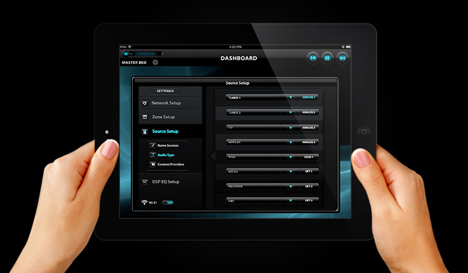
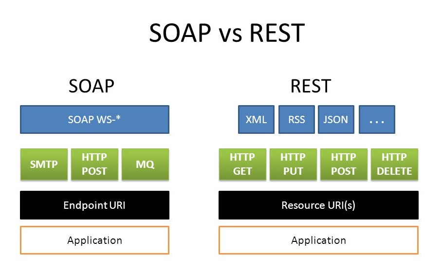
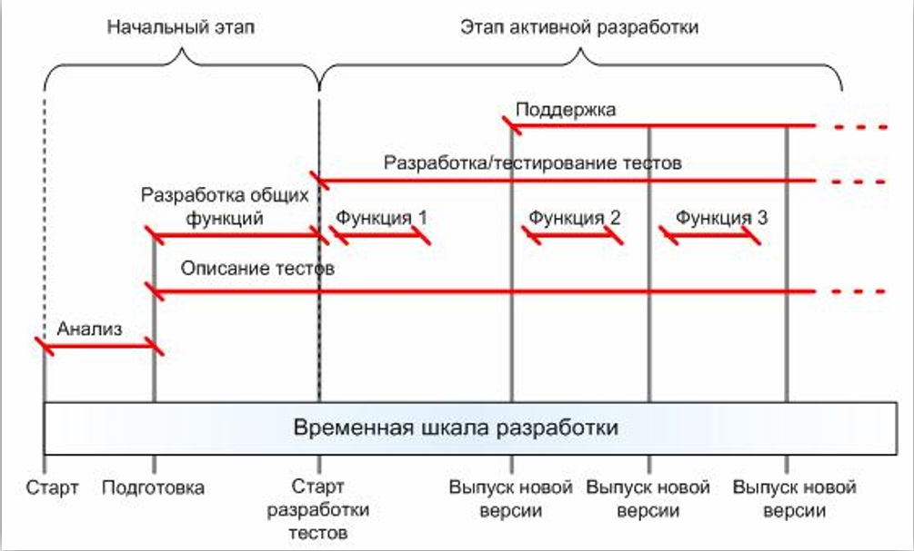
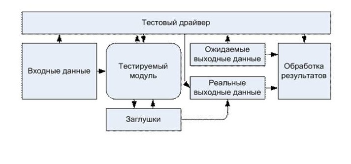
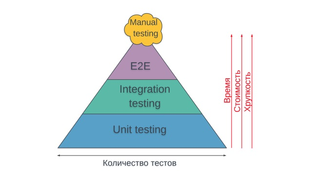
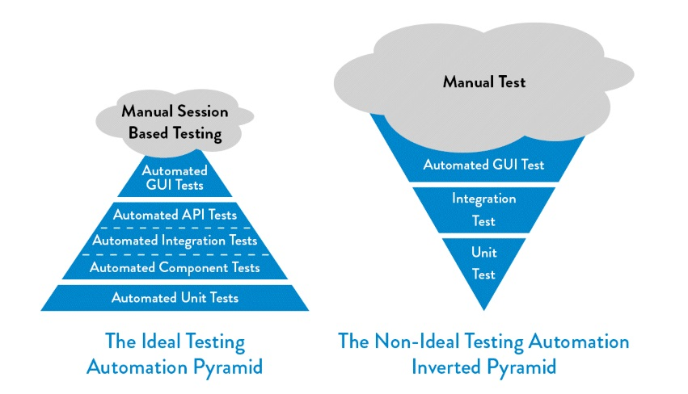
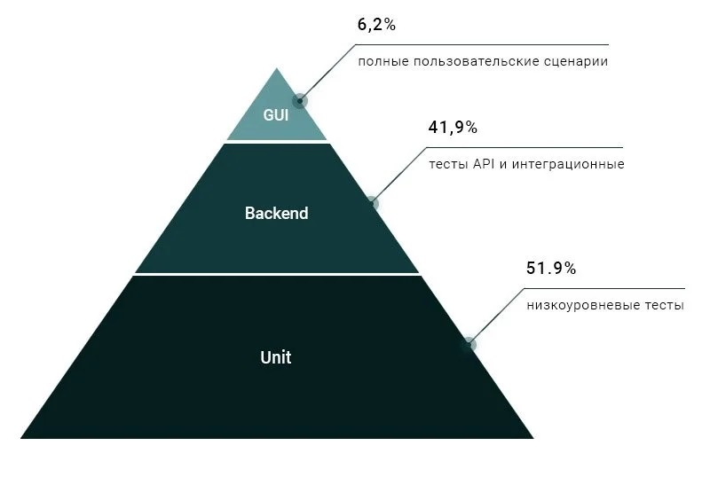

Java_QA / 01. Автоматизация тестирования

***

# Содержание

* [1. Что такое автоматизация тестирования?](#1-что-такое-автоматизация-тестирования)
* [2. Какие есть достоинства и недостатки у автоматизации тестирования?](#2-какие-есть-достоинства-и-недостатки-у-автоматизации-тестирования)
  * [2.1 Достоинства автоматизации тестирования](#21-достоинства-автоматизации-тестирования)
  * [2.2. Недостатки автоматизации тестирования](#22-недостатки-автоматизации-тестирования)
* [3. В каких случаях полезна автоматизация тестирования?](#3-в-каких-случаях-полезна-автоматизация-тестирования)
  * [3.1. Автоматизация будет полезной, если](#31-автоматизация-будет-полезной-если)
  * [3.2. Автоматизация не будет полезной, если](#32-автоматизация-не-будет-полезной-если)
  * [3.3. Автоматизация применяться не может, если](#32-автоматизация-не-будет-полезной-если)
* [4. Какие существуют направления автоматизации тестирования?](#4-какие-существуют-направления-автоматизации-тестирования)
* [5. Из каких этапов состоит автоматизация тестирования?](#5-из-каких-этапов-состоит-автоматизация-тестирования)
  * [5.1. Начальный этап](#51-начальный-этап)
    * [5.1.1. Стадия анализа](#511-стадия-анализа)
    * [5.1.2. Стадия описания](#512-стадия-описания)
    * [5.1.3. Стадия разработки общих функций](#513-стадия-разработки-общих-функций)
    * [5.1.4. Результаты начального этапа](#514-результаты-начального-этапа)
  * [5.2. Активный этап](#52-активный-этап)
    * [5.2.1. Стадия разработки](#521-стадия-разработки)
    * [5.2.2. Стадия поддержки](#522-стадия-поддержки)
    * [5.2.3. Результаты активного этапа](#523-результаты-активного-этапа)
* [6. Из каких процессов состоит автоматизация тестирования?](#6-из-каких-процессов-состоит-автоматизация-тестирования)
* [7. В каком объеме тестировать автотестами?](#7-в-каком-объеме-тестировать-автотестами)
  * [7.1. Принцип пирамиды](#71-принцип-пирамиды)
* [8. Как оценить результат выполнения автоматизированных тестов?](#8-как-оценить-результат-выполнения-автоматизированных-тестов)
  * [8.1. Отчеты и статистика](#81-отчеты-и-статистика)
  * [8.2. Метрики](#82-метрики)
* [9. Как оценить эффективность автоматизации тестирования?](#9-как-оценить-эффективность-автоматизации-тестирования)
  * [9.1. Зачем измерять эффективность?](#91-зачем-измерять-эффективность)
  * [9.2. Тестовое покрытие](#92-тестовое-покрытие)
  * [9.3. Исходные данные](#93-исходные-данные)
  * [9.4. Выполнение оценки](#94-выполнение-оценки)
* [10. Какие существуют инструменты автоматизации тестирования?](#10-какие-существуют-инструменты-автоматизации-тестирования)
  * [10.1. Основные](#101-основные)
  * [10.2. Вспомогательные](#102-вспомогательные)

***

# 1. Что такое автоматизация тестирования?

***Автоматизированное тестирование или автоматизация тестирования*** — процесс тестирования программного обеспечения, 
при котором основные функции и шаги теста, такие как запуск, инициализация, выполнение, анализ и выдача результата, 
производятся автоматически с помощью инструментов для автоматизированного тестирования.

***Инструмент для автоматизированного тестирования*** — программное обеспечение, 
посредством которого осуществляется создание, отладка, выполнение и анализ результатов прогона тест-скриптов.

***Тестовый скрипт*** — набор инструкций для автоматической проверки определенной части программного обеспечения.

Существует два основных подхода к автоматизации тестирования: 

* тестирование на уровне кода (модульное тестирование)

* тестирование на уровне пользовательского интерфейса (GUI тестирование)

***Автоматизатор*** – специалист занимающийся написанием автоматизированных тестов.

Автоматизатор, который миновал стадию ручного тестирования, зачастую умеет просто писать код. 
Но этого мало. И в двух словах всю недостающую базу не объяснишь. 
Чтобы ее получить, нужно обратиться в сторону функционального тестирования, 
как бы странно это ни звучало. Мы же в первую очередь тестировщики, а уже потом автоматизаторы.

***Автоматизированный тест (Автотест)*** – скрипт, имитирующий взаимодействия пользователя с приложением, 
цель которого – локализация ошибок в работе программного обеспечения.

***

# 2. Какие есть достоинства и недостатки у автоматизации тестирования?

## 2.1 Достоинства автоматизации тестирования

* *Оперативность* 

Автоматизированный тестовый сценарий не сверяется с инструкциями и документацией.

* *Экономия времени* 

Автоматизированный тестовый сценарий не требует вмешательства тестировщика.

* *Повторное использование* 

Автоматизированный тестовый сценарий может использоваться неоднократно.

* *Отсутствие «человеческого фактора»* 

Автоматизированный тестовый сценарий не допустит оплошностей в результатах и не пропустит времени тестирования.

* *Автоматическая отчетность* 

Результаты автоматизированного тестирования автоматически сохраняются и рассылаются всем причастным специалистам.

## 2.2. Недостатки автоматизации тестирования

* *Затраты* 

Хорошие инструменты автоматизированного тестирования, как и обучение автоматизированному тестированию ПО требует вложений.

* *Однообразие*

Написанные тесты работают всегда одинаково, что не всегда плохо, но иногда позволяет пропустить дефект, который заметил бы живой человек.

* *Затраты на поддержку и разработку* 

Чем сложнее приложение и чем чаще оно обновляется, тем более затратная разработка и модификация автоматизированных тестов.

* *Пропуск мелких недочетов*

Тесты пропускают небольшие ошибки, на проверку которых не запрограммированы. 

* *Стоимость инструмента для автоматизации* 

В случае, если используется лицензионное ПО, его стоимость может быть достаточно высока. 
Свободно распространяемые инструменты, как правило, отличаются более скромным функционалом и меньшим удобством работы.

***

# 3. В каких случаях полезна автоматизация тестирования?

## 3.1. Автоматизация будет полезной, если

* Ваша первоочередная задача – сэкономить время проектной команды
* Тесты должны выполняться для каждой сборки приложения
* Ваш проект длительный или комплексный (состоит из различных итераций)
* На выполнение тест-кейсов тратится много времени и ресурсов
* Проводится нагрузочное или стресс-тестирование
* Нужно сократить текущий объем тестирования с целью успеть к определенным срокам

## 3.2. Автоматизация не будет полезной, если

* Для выполнения тестирования нужен человеческий интеллект и интуиция
* Процесс тестирования ограничен интуитивными или исследовательским проверками
* Требования, относящиеся к существующей функциональности, часто изменяются
* Нужно провести тестирование только единожды

## 3.3. Автоматизация применяться не может, если

* Необходимо тестирование пользовательского интерфейса 

Ручное тестирование проверит общий вид приложения (четкость изображений, расположение и отображение элементов 
графического интерфейса при разных разрешениях экрана и др.), а также отдельно взятые компоненты 
(например, цвет шрифта – сможет ли конечный пользователь его легко воспринимать). 
Ручные проверки покажут, соответствует ли графический интерфейс предпочтениям потребителей.

* Необходимо тестирование удобства использования. 

Оно ответит с точки зрения пользователя на вопрос, является приложение простым в использовании или нет.

* Необходимо интуитивное тестирование. 

Это тип проверок, при котором тест-кейсы не создаются заранее, а QA-инженеры тестируют приложение и исследуют его «на ходу».

***

# 4. Какие существуют направления автоматизации тестирования?

**UI - тестирование** — оценка функционирования графического интерфейса приложения.

**API - тестирование (Тестирование веб-сервисов)** — тестирование функционала web-сервисов, реализованное автоматизированными средствами.

**Тестирование мобильных приложений** — проверка работоспособности функционала мобильного приложения на различных мобильных устройствах и операционных системах.

**Тестирование баз данных** — оценка соответствия БД функциональным и нефункциональным требованиям.

**Тестирование веб-приложений** — проверка работоспособности модулей веб-приложений

***

# 5. Из каких этапов состоит автоматизация тестирования?

1. **Начальный этап**

* Анализ
* Описание тестов
* Разработка общих функций

2. **Активный этап**

* Разработка
* Поддержка

Схема этапов

## 5.1. Начальный этап

### 5.1.1. Стадия анализа

На этой стадии:

* Принимается решение о необходимости автоматизированного тестирования
* Оцениваются потенциальные возможности и экономический эффект
* Определяются цели и стратегии автоматизации
* Выделяются виды тестов, пригодные для автоматизации
* Определяется объем автоматизации тестирования
* Осуществляется выбор средства автоматизации тестирования

***Объем автоматизации*** – это область тестируемого приложения, которая будет автоматизирована.

Объем автоматизации помогают определить следующие пункты:

* Функции, важные для бизнеса
* Сценарии с большим объемом данных
* Общие функции приложений
* Техническая осуществимость
* Частота повторного использования бизнес-компонентов
* Сложность тестовых случаев
* Возможность использовать одни и те же тестовые сценарии для кросс-браузерного тестирования

Выбор средства автоматизации тестирования во многом зависит от технологии, на которой построено тестируемое приложение.

### 5.1.2. Стадия описания

На этой стадии:

* Уточняются требования к описанию тестов
* Проверяется совместимость средств автоматизации и тестируемого программного средства, а также тестового окружения
* Вырабатываются точные методы оценки затрат на реализацию
* Определяются стандарты разработки тестовых скриптов, руководств, 
требования к аппаратному и программному обеспечению, сетевому окружению, наборам тестовых данных
* Определяются методы контроля тестового окружения и система мониторинга дефектов системы

### 5.1.3. Стадия разработки общих функций

На этой стадии:

* Анализируются и разрабатываются общие функции

### 5.1.4. Результаты начального этапа

Результатами начального этапа процесса автоматизации являются:

* Выбранные инструменты автоматизации тестирования
* Конструкция фреймворка автоматизации тестирования и его особенности
* Входящие и выходящие за рамки элементы автоматизации
* Подготовка стендов автоматизации
* График и временная шкала сценариев и выполнения

## 5.2. Активный этап

### 5.2.1. Стадия разработки

На этой стадии:

* Описание автотестов
* Разработка автотестов
* Тестирование автотестов
* Запуск автотестов 
* Составление отчета о запуске автотестов
* Составление отчета о найденных дефектах
* Анализ результатов 
* Доработка автотестов 

### 5.2.2. Стадия поддержки

Для автоматизации тестирования выбираются только те тесты, которые проверяют неизменяющуюся часть программы. 
Однако, изменение требований к входным данным, обновление настроек или структуры тестового окружения могут привести к тому, 
что автоматические тесты будут выдавать ошибочные результаты. 
Поэтому всегда необходимо следить за изменениями в системе и при необходимости корректировать или 
дорабатывать автоматические тесты для поддержания их в актуальном состоянии.

### 5.2.3. Результаты активного этапа

Результатами начального этапа процесса автоматизации являются:

* Разработанные автотесты
* Запуски автотестов
* Результаты запуска автотестов
* Найденные дефекты

***

# 6. Из каких процессов состоит автоматизация тестирования?

**Подготовка тестового окружения**

Перед началом запуска прогона тестов производится настройка тестового окружения – 
проверяются подключения, настройки и т д. 

**Генерация тестовых данных**

Наиболее ресурсоёмкая часть тестирования – это подготовка тестовых данных. 
Они зависят от типа и цели тестирования, стадии разработки проекта и много от чего ещё.

**Запуск тестов**

Производится запуск автоматизированных тестов и проведение регрессионного автоматизированного тестирования, если необходимо.

**Формирование отчета**

Составляется итоговый документ с результатами тестирования, который содержит обнаруженные дефекты, 
отклонения от нормативов и предложения по улучшению системы. 
Создаются руководство пользователя и инструкции по настройке и 
сопровождению системы автоматизированного функционального тестирования.

**Очистка окружения после тестирования**

Производится восстановление состояния тестового окружения к изначальному.

**Анализ результатов**

Проводится анализ результатов тестирования. Делаются выводы об успешности проведенного тестирования.

***

# 7. В каком объеме тестировать автотестами?

## 7.1. Принцип пирамиды

Автоматизация процессов тестирования тесно связана с именем Майка Кона, автора книги **Scrum. Гибкая разработка ПО**. 
Он представил систему автоматизации тестирования в виде пирамиды.

Основание пирамиды составляет **модульное тестирование (Unit tests)** – процесс проверки отдельных модулей исходного кода. 

За ним следует **компонентное/интеграционное/API тестирование (Component/Integration/API tests)** – на этом этапе отдельные программные модули тестируются в группах.
 
Далее может следовать **приемочное тестирование (Acceptance tests)**, определяющее пригодность продукта к предстоящей эксплуатации. 

На вершине пирамиды обосновалось **тестирование пользовательского интерфейса (UI tests)**, которое может проводиться как автоматизировано, так и вручную. 

Таким образом, автоматизированное тестирование находится на стыке тестирования и программирования.

Над вершиной часто располагают **ручное тестирование** в форме облака, поскольку оно не считается неотъемлемой частью пирамиды, хоть и взаимосвязано с ней. 

Данная пирамида считается типичной для автоматизации тестирования, хотя может быть перевернута и модифицирована в зависимости от специфики работ.

И чем ближе к вершине пирамиды, тем меньше должно быть тестов.

***

# 8. Как оценить результат выполнения автоматизированных тестов?

## 8.1. Отчеты и статистика

После выполнения автоматизированных тестов составляются отчеты в виде таблиц, графиков, диаграмм. 
Для этого применяются различные инструменты, плагины и библиотеки. Например **Allure** или **Report Portal**.
В отчетах ведется автоматический подсчет количества успешно отработанных сценариев, упавших тестов, найденных багов. 

## 8.2. Метрики

Далее на основе полученных данных по специальным методикам составляются метрики, 
позволяющие сделать выводы о результатах тестирования.

Каждая метрика в автоматизации тестирования должна удовлетворять следующим критериям:

* измеримость
* объективность
* основаны на данных, которые легко доступны
* осмысленность
* простота
* может помочь найти направления для улучшения и совершенствования процесса автоматизации

Метрики автоматизации тестирования:

* *Процент автоматизируемых тестов (кейсов)*

PA(%) = количество кейсов, которые могут быть автоматизированы / общее количество кейсов  

Не всё нужно и не всё возможно автоматизировать. 
Имея список тест кейсов, которые хотелось бы автоматизировать, 
логично узнать соотношение (умножение на 100 опустим):

* *Продвижение автоматизации*

TP = количество заавтоматизированных кейсов / промежуток времени, за которое были написаны тесты

Подходящая метрика для определения производительности и оценок сроков на тестовое покрытие. 
Если она резко взлетает или резко падает, стоит задаться вопросами. 
В первом случае — возможно и скорее всего, создаётся видимость работы как результат сильного дробления проверок, что тоже не очень хорошо. 
Во втором — возможно в автоматизатора упала мотивация или происходят постоянные ошибки с естимацией работ.

* *Продвижение автоматизации*

AP(%) = количество автоматизированных кейсов / количество кейсов, которые могут быть автоматизированы

Данная метрика очень важна при рассмотрении процесса автоматизации в отрезке времени. 
Если с каждой новой итерацией процент продвижения падает, стоит задуматься о том, 
почему такое происходит — пересмотреть архитектуру, возможности, взгляды, 
и даже добавить при необходимости людей в команду и т.д. Конечно, здесь нужно стремится к 100%

* *Плотность дефектов (багов)*

TC(%) = количество открытых багов/ общий размер приложения

Очень важная метрика, которой пренебрегают ввиду отсутствия подходящей возможности оценить, что такое размер тестируемого приложения. 
Есть стандартное представление о том, что в среднем на три строчки кода приходится по одному багу. 
Это самый настоящий бред, а если это и так, то никакое тестирование такому проекту уже не поможет.
В общем, при использовании Scrum методологии можно в качестве этого самого размера приложения просуммировать все story points, — 
если найденных багов мало, нормируйте формулу. 
Это очень полезная метрика как в самой команде, так и снаружи, — особенно когда продукт на стадии релиза. 

* *Покрытие требований автоматизированными кейсами*

TC(%) = количество заавтоматизированных кейсов/ количество требований

Сложная, но полезная метрика, когда речь идёт об оценке глубины покрытия. 
Наверное, лучше даже брать обратную пропорцию в качестве процента. 
Если грамотно её использовать, например, фича-тесты в Agile методологии, 
то можно не только прикинуть сколько накопится тестов через несколько недель/месяцев, 
но и понять, что пришло время к оптимизации для сокращения времени прогона автотестов.

* *Эффективность устранения дефектов*

DRE(%) = баги, найденные во время тестирования / (баги, найденные в процессе тестирования + баги, найденные пользователями в production)

Довольно важная метрика, без которой никуда. 
Если в результате прогона автотестов имеем, допустим, 10 багов, исправляем их, 
а после выкатывания пользователям замечаем ещё 10 новых, то это печально — значит не следили за метриками выше. 
Получив это процентное соотношение, надо как можно быстрее поднять его до 100%. 
Таким образом, эту метрику нужно рассматривать во времени после деплоймента. 
Автотесты на вновь возникшие баги должны быть написаны немедленно и должны падач1ть, а не проходить.

***

# 9. Как оценить эффективность автоматизации тестирования? 

Внедрение и поддержка автоматических тестов – очень ресурсоемкая, соответственно, недешевая процедура. 
Повсеместное использование этого инструмента чаще всего ведет к значительным финансовым потерям без какого-либо значимого результата.
Как можно при помощи достаточно простого инструмента оценить возможную эффективность использования автотестов на проекте?

Наиболее распространенный способ оценки эффективности (прежде всего экономической) является **Расчет Возврата Инвестиций (ROI)**. 
Вычисляется он достаточно просто, являясь отношением прибыли к затратам. 
Как только значение ROI переходит единицу – решение возвращает вложенные в него средства и начинает приносить новые.

В случае автоматизации под прибылью понимается экономия на ручном тестировании. 
Кроме того, что прибыль в данном случае может быть и не явной – например, 
результаты нахождения дефектов в процессе ad-hoc тестирования инженерами, 
время которых высвободилось за счет автоматизации. Такую прибыль достаточно сложно рассчитать, 
поэтому можно либо делать допущение (например +10%) либо опускать.

Однако не всегда экономия является целью внедрения автоматизации. 
Один из примеров – скорость выполнения тестирования (как по скорости выполнения одного теста, так и по частоте проведения тестирования). 
По ряду причин скорость тестирования может быть критической для бизнеса – если вложения в автоматизацию окупаются полученной прибылью.

Другой пример – исключение «человеческого фактора» из процесса тестирования систем. 
Это важно, когда точность и корректность выполнения операций является критической для бизнеса. 
Цена такой ошибки может быть значительно выше стоимости разработки и поддержки автотеста.

## 9.1. Зачем измерять эффективность?

Измерение эффективности помогает ответить на вопросы: 

* стоит ли внедрять автоматизацию на проекте?
* когда внедрение принесет нам значимый результат?
* сколько часов ручного тестирования мы заместим?
* можно ли заменить 3 инженеров ручного тестирования на 1 инженера автоматизированного тестирования?

и др.

Данные расчеты могут помочь сформулировать цели (или метрики) для команды автоматизированного тестирования. 
Например, экономия X часов в месяц ручного тестирования, сокращение расходов на команду тестирования на Y условных единиц.

## 9.2. Тестовое покрытие

Для того чтобы сформировать данные для оценки, необходимо определиться с автоматизируемым тестовым покрытием. 
Для его выделения стоит руководствоваться следующими двумя простыми правилами:

* покрываемая функциональность должна быть достаточно стабильной (чем стабильнее функциональность, тем меньше затраты на поддержку тестов);
* покрываемая функциональность должна тестироваться регулярно и часто (чем чаще выполняется тестирование функциональности, тем быстрее окупается ее автоматизация; редко и нерегулярно тестируемая функциональность не эффективна для автоматизации – ее выгоднее тестировать вручную);
* возможность тестирования при помощи автотестов.

## 9.3. Исходные данные

Для расчета эффективности автоматизации на проекте требуется набор входных данных, получить которые несложно.

* стоимость (в человеко-часах) ручного тестирования в рамках выбранного покрытия.
* стоимость разработки автотестов (в человеко-часах) автотестов в рамках данного покрытия.
* данные по частоте проведения тестирования.

## 9.4. Выполнение оценки

Обычно интервал для анализа составляет месяц. 
Но его вполне можно адаптировать под конкретный проект – например, взять спринт или недельный интервал.

Для начала вычисляем затраты по ручному тестированию за каждый интервал. 
Обратите внимание, что затраты уменьшаются (замещаются автотестами). 

Затем вычисляем затраты на разработку тестов.
Необходимо учесть предполагаемый размер команды автоматизации на проекте – это покажет, 
насколько быстро мы сможем реализовать автотесты, заместив ручное тестирование.

Затем вычисляем сумму этих затрат. 
По сути – это суммарные затраты на тестирование. 

Добавляем для сравнения затраты на ручное тестирование (без автоматизации). 

Далее высчитываем накопленные затраты по тестированию с и без автоматизации.
Разница между этими значениями покажет нам эффективность процесса автоматизации (экономия трудозатрат) на данном отрезке времени.

***

# 10. Какие существуют инструменты автоматизации тестирования?

К инструментам автоматизации тестирования относят программное обеспечение, используемое для создания, 
наладки, выполнения и анализа результатов работы автоматизированных тестов.

Выбор инструмента зависит от объектов тестирования и требований к сценариям тестов. 
Естественно, что один инструмент не в состоянии поддерживать весь спектр технологий, 
потому остается только пробовать и искать наиболее подходящий. 
Достаточно часто QA-инженеры останавливают свой выбор на нескольких инструментах.

Инструменты делятся на основные и вспомогательные:

## 10.1. Основные

* Язык программирования – Java, Ruby, Python, C#, JS 
* Сборщик проектов – Maven, Gradle
* Фреймворк тестирования – JUnit, TestNG, PyTest, NUnit 
* BDD фреймворк – Cucumber
* Драйвер – Selenium WebDriver

## 10.2. Вспомогательные

* Среда разработки – Jetbrains IntelliJ IDEA, MS Visual Studio
* Система контроля версий – Git, SVN
* Сервис хранения проектов - Github, Bitbucket
* Сервер непрерывной интеграции – Jenkins, Gitlab CI, TeamCity, Bamboo
* Инструменты хранения и анализа отчетов – Allure, Report Portal
* Система управления тестами – Zephyr, HP ALM, Test IT

***

