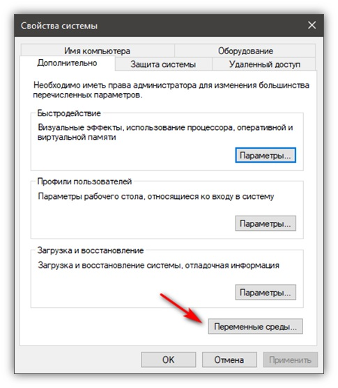
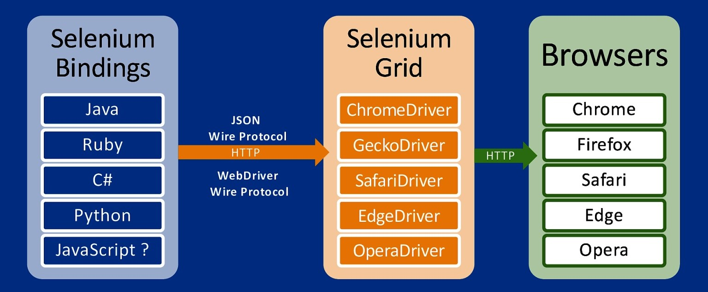
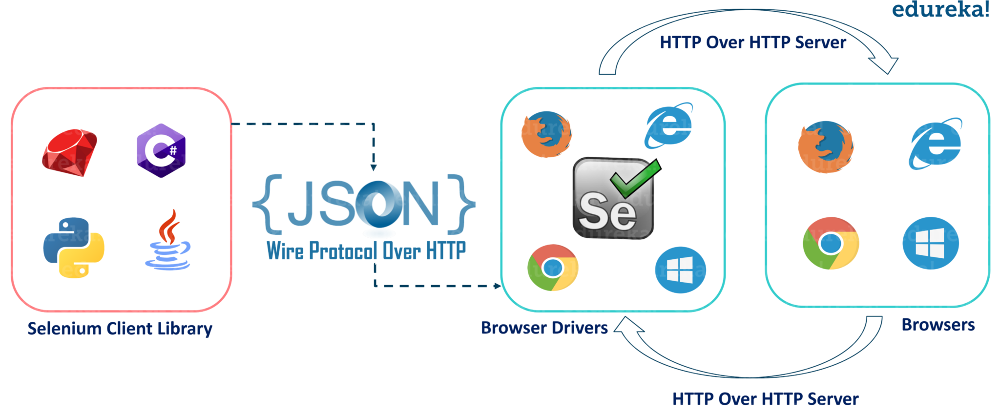

# Java_QA / Level 1. Easy - Основы / 1.1. Selenium WebDriver / Урок 01. Введение

[](README.md)

***

## 1. Что такое Selenium?

***Selenium*** – проект, в рамках которого разрабатывается серия программных продуктов с открытым исходным кодом (open source):

* Selenium RC

* Selenium WebDriver

* Selenium Server

* Selenium Grid

* Selenium IDE

Называть просто словом Selenium любой из этих пяти продуктов, вообще говоря, неправильно, хотя так часто делают, 
если из контекста понятно, о каком именно из продуктов идёт речь, или если речь идёт о нескольких продуктах одновременно, 
или обо всех сразу.

### Selenium RC

**Selenium RC ("R"-emote "C"-ontrol)** - система для управления браузером. 

Является предшественником Selenium WebDriver.

Эта версия с функциональной точки зрения значительно уступает WebDriver. 
Сейчас она находится в законсервированном состоянии, не развивается и даже известные баги не исправляются. 
А всем, кто сталкивается с ограничениями Selenium RC, предлагается переходить на использование WebDriver.

Иногда Selenium RC называется также Selenium 1.0, тогда как WebDriver называется Selenium 2.0. 
Хотя на самом деле дистрибутив версии 2.0 включает в себя одновременно обе реализации – 
и Selenium RC, и WebDriver. А вот когда выйдет версия 3.0 – в ней останется только WebDriver.

С технической точки зрения WebDriver не является результатом эволюционного развития Selenium RC, 
они построены на совершенно разных принципах и у них практически нет общего кода. 
Объединяет их лишь тот факт, что обе реализации были сделаны в рамках проекта Selenium. 
Ну, или если быть совсем точным, WebDriver сначала был самостоятельным проектом, 
но в 2008 году произошло слияние и сейчас WebDriver представляет собой основной вектор развития проекта Selenium.

### Selenium WebDriver

**Selenium WebDriver** - программная библиотека для управления браузерами, которая отправляет команды непосредственно в браузер, и извлекает результаты.

Является преемником Selenium RC.

Иногда говорят, что это *драйвер браузера*, но на самом деле это целое семейство драйверов для различных браузеров, 
а также набор клиентских библиотек на разных языках, позволяющих работать с этими драйверами.
Это основной продукт, разрабатываемый в рамках проекта Selenium.
Selenium WebDriver называется также Selenium 2.0, причина этого будет объяснена ниже.

Как уже было сказано, WebDriver представляет собой семейство драйверов для различных браузеров плюс набор клиентских 
библиотек для этих драйверов на разных языках программирования. 
В рамках проекта Selenium разрабатываются драйверы для браузеров Firefox, Internet Explorer и Safari, 
а также драйверы для мобильных браузеров Android и iOS. 
Драйвер для браузера Google Chrome разрабатывается в рамках проекта Chromium, 
а драйвер для браузера Opera (включая мобильные версии) разрабатывается компанией Opera Software. 
Поэтому они формально не являются частью проекта Selenium, распространяются и поддерживаются независимо. 
Но логически, конечно, можно считать их частью семейства продуктов Selenium.

Аналогичная ситуация и с клиентскими библиотеками – в рамках проекта Selenium разрабатываются библиотеки для языков 
Java, .Net (C#), Python, Ruby, JavaScript. Все остальные реализации не имеют отношения к проекту Selenium, хотя, возможно, 
в будущем, какие-то из них могут влиться в этот проект.


### Selenium Server

**Selenium Server** - сервер, который позволяет управлять браузером с удалённой машины, по сети. 

Сначала на той машине, где должен работать браузер, устанавливается и запускается сервер. 
Затем на другой машине (технически можно и на той же самой, конечно) запускается программа, которая, 
используя специальный драйвер RemoteWebDriver, соединяется с сервером и отправляет ему команды. 
Он в свою очередь запускает браузер и выполняет в нём эти команды, используя драйвер, соответствующий этому браузеру.

Selenium Server поддерживает одновременно два набора команд – для новой версии (WebDriver) и для старой версии (Selenium RC).



### Selenium Grid

**Selenium Grid** - кластер, состоящий из нескольких Selenium-серверов, предназначенный для организации распределённой сети, 
позволяющей параллельно запускать много браузеров на большом количестве машин.

Используется для параллельного тестирования на разных компьютерах и разных браузерах одновременно, что приводит к минимизации времени выполнения.

Selenium Grid имеет топологию "звезда", то есть в его составе имеется выделенный сервер, который носит название "хаб" или "коммутатор", а остальные сервера называются "ноды" или "узлы". 
Сеть может быть гетерогенной, то есть коммутатор и узлы могут работать под управлением разных операционных систем, на них могут быть установлены разные браузеры. 
Одна из задач Selenium Grid заключается в том, чтобы "подбирать" подходящий узел, когда во время старта браузера указываются требования к нему – 
тип браузера, версия, операционная система, архитектура процессора и ряд других атрибутов.

Ранее Selenium Grid был самостоятельным продуктом. Сейчас физически продукт один – Selenium Server, но у него есть несколько режимов запуска: он может работать как самостоятельный сервер, 
как коммутатор кластера, либо как узел кластера, это определяется параметрами запуска.



### Selenium IDE

**Selenium IDE ("I"-ntegrated "D"-evelopment "E"-nvironment)** - плагин к браузеру Firefox для записи и воспроизведения действий пользователя, 
а также генерации исходного кода для WebDriver или Selenium RC, в котором выполняются те же самые действия.

Тестировщики, которые не умеют (или не хотят) программировать, используют Selenium IDE как самостоятельный продукт, без преобразования записанных сценариев в программный код. 
Это, конечно, не позволяет разрабатывать достаточно сложные тестовые наборы, но некоторым хватает и простых линейных сценариев.

***

## 2. История развития

### Selenium Core

| Дата          | Событие                           |
|--------------:|-----------------------------------|
| 3 ноября 2004 | первый коммит (Firefox 1.0, IE 6) |

2004 год 

* *Jason Huggins* (ThoughtWorks) написал на **JavaScript** библиотеку, названную **JavaScriptTestRunner** (ныне известную как **Selenium Core**) и предназначенную для запуска тестов в браузере. 

> Тогда Huggins работал в офисе фирмы ThoughtWorks, расположенном в городе Чикаго, а созданная библиотека использовалась для тестирования сайта, написанного на языке Python 
с использованием системы управления содержанием (CMS) Plone. 

* *Jason Huggins* (ThoughtWorks) помогали *Paul Gross* и *Jie Tina Wang* (ThoughtWorks), позднее к разработке присоединились другие разработчики и тестировщики компании.

> Название **Selenium** (selenium в переводе с английского языка — селен) стало использоваться после того, как в одном из своих электронных писем (email) Huggins пошутил о конкурирующем проекте, 
имеющем название **Mercury Interactive QuickTest Professional** (mercury в переводе с английского языка — ртуть), написав, что можно вылечиться от отравления ртутью, принимая с пищей селен.

* *Paul Hammant* (ThoughtWorks) предложил открыть исходный код библиотеки **Selenium Core**, предоставить возможность писать сценарии на любом языке программирования и запускать сценарии удалённо. 

> Для реализации последнего требовалось обойти ограничения, реализуемые браузером для выполнения правила ограничения домена (same origin policy). 

* *Aslak Hellesoy* и *Mike Melia* (ThoughtWorks) написали **Page Rewriter** для обхода правила ограничения домена. 

* *Paul Hammant* написал программы на языке **Java**, реализующие сервер и клиент. 

* *Aslak Hellesoy* и *Obie Fernandez* переписали клиент на языке **Ruby** в виде библиотеки.

> Сотрудники фирмы ThoughtWorks, офисы которой располагались по всему миру, стали использовать **Selenium** в коммерческих проектах. 

* *Mike Williams*, *Darrell Deboer* и *Darren Cotterill* продолжили разработку.

### Selenium Remote Control (Selenium RC)

| Дата             | Событие                               |
|-----------------:|---------------------------------------|
|    декабрь  2004 | новая архитектура                     |
|  4 февраля  2005 | интерфейс XMLRPC                      |
| 17 апреля   2005 | первый лотогип                        |
|  3 мая      2005 | Selenium 0.3 («детство» Selenium RC)  |
| 25 сентября 2005 | Selenium 0.6 («взрослый» Selenium RC) |
| 29 марта    2006 | Selenium 0.7 (Selenium RC)            |

2004 год 

* *Dan Fabulich* и *Nelson Sproul* (BEA Systems, Inc.) переписали код сервера, для реализации HTTP-proxy использовали код из проекта Jetty (HTTP-сервер на Java). 

* Новый сервер стал известен как **Selenium Remote Control** или **Selenium RC**. 

* *Pat Lightbody*, *Dan Fabulich* и *Nelson Sproul* продолжили работу над Selenium RC.

* Исходный код проекта **Selenium** был открыт.

### Selenium 1.0

| Дата            | Событие            |
|----------------:|--------------------|
| 11 декабря 2005 | организация OpenQA |
| 14 ноября  2008 | Selenium 1.0       |
|  6 июня    2009 | Selenium 1.0.1     |

2005 год

* *Dan Fabulich*, *Nelson Sproul* и *Pat Lightbody* (BEA Systems, Inc.) на встрече разработчиков предложили принять набор патчей, превращающих **Selenium RC** в продукт, известный сегодня как **Selenium 1.0**. 

> На той же встрече управление проектом было возложено на комитет, а разработчики *Jason Huggins* и *Paul Hammant* стали представлять фирму ThoughtWorks в созданном комитете.

2006 год
 
* Разработкой библиотеки **Selenium Core** занималась команда разработчиков, состоявшая из *Wang Peng Chao*, *Huang Liang*, *Xiong Jie* и других, под руководством *Mike Williams* в офисе фирмы ThoughWorks, 
расположенном в Китае. Команда реализовала возможности, доступные в *Selenium 1.0*.

2007 год 

* *Jason Huggins* нанялся работать в фирму Google, стал членом (тогда секретной) команды поддержки **Selenium** и совместно с другими разработчиками продолжил работу над **Selenium RC**. 

> Представители фирмы Google впервые объявили об использовании **Selenium** на конференции **Google Test Automation Conference** (GTAC-2007), проходившей в Нью-Йорке 23-24 августа 2007 года. 

### Selenium WebDriver

| Дата            | Событие                           |
|----------------:|-----------------------------------|
|  3 января  2007 | первый публичный коммит           |
| 22 ноября  2009 | слияние Selenium RC и WebDriver   |
|    июль    2011 | Selenium 2.0                      |
|    март    2016 | Selenium 2.53 (последний релиз 2) |
|    октябрь 2016 | Selenium 3.0                      |

2007 год

* *Haw-bin Chai* из Чикаго создал патчи, добавляющие функциональность **XPath** и реализующие расширение, названное **UI Element**, после чего был приглашён в команду разработчиков **Selenium**.

* *Simon Stewart* (ThoughtWorks) разработал инструмент, названный **WebDriver**. 

> WebDriver запускал браузеры и работал с ними, при этом не был ограничен возможностями, предоставляемыми JavaScript, поэтому по возможностям превосходил **Selenium Core**. 
Но для поддержки каждого браузера требовалось написание кода. 

* *Simon Stewart* (ThoughtWorks) представил свою разработку на конференции GTAC-2007. 

2009 год 

* Разработчики на конференции GTAC-2009 приняли решение о слиянии кодовых баз проектов **Selenium** и **WebDriver**. 

> В 2007—2012 годах *Simon Stewart* работал в фирме Google, а затем — в фирме Facebook, при этом часть своего рабочего времени тратил на то, чтобы сделать **WebDriver** совместимым с **Selenium RC**. 

2011 год

* Новый продукт был назван **Selenium WebDriver** или **Selenium 2.0**.

2016

* Релиз **Selenium 3.0**

> **Selenium 3.0** как 2.0, но без Selenium RC.

### Selenium Grid

| Дата | Событие           |
|-----:|-------------------|
| 2008 | Selenium Grid 1.0 |
| 2011 | Selenium Grid 2.0 |
| 2016 | Selenium Grid 3.0 |
| 2019 | Selenium Grid 4.0 |

2008 год 

* *Philippe Hanrigou* (ThoughtWorks) создал проект **Selenium Grid**. 

> **Selenium Grid** — проект с открытым исходным кодом, предоставляющий программы, предназначенные для запуска сценариев **Selenium RC** на нескольких компьютерах одновременно. 
Разные сценарии запускались на нескольких компьютерах для уменьшения времени их выполнения. Возможности **Selenium Grid** совпадали с возможностями аналогичного, но закрытого и внутреннего, продукта фирмы Google. 

### Selenium IDE

| Дата          | Событие               |
|--------------:|-----------------------|
| сентябрь 2005 | рождение Selenium IDE |

2005

* *Shinya Kasatani* из Японии создал расширение для браузера Firefox, получившее название **Selenium IDE** и позволяющее записывать тесты, сохранять их и воспроизводить. 
Расширение не было ограничено правилом ограничения домена (same origin policy).

***

## 3. Selenium 4.0

| Дата        | Событие              |
|------------:|----------------------|
| май    2019 | Selenium 4.0 Alpha 1 |
| май    2019 | Selenium 4.0 Alpha 2 |
| июль   2019 | Selenium 4.0 Alpha 3 |
| январь 2020 | Selenium 4.0 Alpha 4 |
| март   2020 | Selenium 4.0 Alpha 5 |

### В чем важность Selenium 4?

Selenium стал отраслевым стандартом для проведения автоматизированного тестирования. 
Он считается первоочередным инструментом для тестирования веб-приложений уже слишком масштабных для проведения ручного тестирования.

### Особенности версии Selenium 4.0

#### Основные изменения в Selenium 4

* **стандартизация W3C**

Благодаря этому изменению запросы и ответы, передаваемые по протоколу, не требуют API кодирования и декодирования. 
На основе обновления стандартов W3C любое программное обеспечение, соответствующее стандартам W3C, 
может быть интегрировано с Selenium 4 без каких-либо проблем совместимости.

* **драйверы от производителей**

Почти все браузеры, такие как Chrome, Safari и IE, уже соответствуют стандарту W3C и имеют официальные драйверы.

* **движок для различных инструментов**

API WebDriver стал актуальным и за пределами Selenium и теперь используется в различных инструментах для автоматизации. 
Например, на нем основываются такие мобильные инструменты для тестирования, как Appium и iOS Driver.

* **поддержка браузеров**

Встроенная поддержка была удалена для Opera и PhantomJS, поскольку реализации WebDriver для этих браузеров больше не находятся в активной разработке.

* **обновление Selenium IDE**

Предыдущая версия Selenium IDE устарела в 2017 году. 
Новая версия Selenium IDE предлагает более продвинутые возможности:

1) улучшенный пользовательский интерфейс
2) экспорт кода для всех официальных языков (Java, Python, JavaScript, .Net и Ruby)
3) новый CLI runner

Он полностью основан на NodeJS, а не на HTML, как было раньше, также он будет иметь следующий возможности:

1) WebDriver Playback - новый runner будет полностью основан на WebDriver
2) параллельное выполнение - новый runner будет поддерживать параллельное выполнение тестов и предоставит полезную информацию, 
такую как затраченное время, а также набор пройденных и неудачных тестов

* **оптимизация Selenium Grid**

Каждый, кто когда-либо работал с Selenium Grid знает как сложно его настраивать.
До настоящего времени процесс присоединения узла к хабу в Selenium Grid вызывал серьезные сложности.
В Selenium 4 работа с Grid обещает быть простой, так как больше не будет необходимости настраивать и запускать хабы и узлы отдельно. 
После запуска сервера в Selenium Grid 4, он будет работать одновременно и как узел, и как хаб.
Selenium 4 будет поставляться с более стабильной версией Selenium Grid. 
Будут устранены ошибки потокобезопасности и улучшена поддержка Docker.

* **обновленная документация**

Документация играет ключевую роль в успехе любого проекта. Документация Selenium не обновлялась с выпуска Selenium 2.0. 
Это значит, что каждый, кто пытался изучить Selenium в последние несколько лет, пользовался старыми туториалами.
Selenium 4 выходит с официальной и подробной документацией по Selenium IDE, Selenium WebDriver и Selenium Grid.

* **реализации на всех популярных языках**

#### Новые возможности в Selenium 4

* **относительные локаторы**

В Selenium 4 появились относительные локаторы (также известные как дружественные локаторы), которые позволяют находить веб-элементы по их положению относительно других веб-элементов.

* **несколько вкладок и окон**

В Selenium 4 можно работать с несколькими вкладками или окнами. 
То есть открыть новую вкладку или окно в том же сеансе, не создавая новый объект драйвера.

* **скриншоты WebElement**

Selenium 3 позволяет делать снимки только веб-страниц и не позволяет делать снимки экрана с конкретными веб-элементами. 
Selenium 4 позволяет делать снимки экрана определенного веб-элемента.

* **инструменты разработчика Chrome (Chrome Dev Tools)**

Selenium 4 имеет встроенную поддержку протокола Chrome DevTools через интерфейс «DevTools». 
Благодаря этому мы можем получить такие свойства разработки Chrome, как кэш приложения, выборка, производительность, сеть, профилировщик, 
синхронизация ресурсов, безопасность и целевые домены CDP и т. Д.

## 4. Стандарт W3C WebDriver

| Дата           | Событие                           |
|---------------:|-----------------------------------|
|  2 марта  2011 | первая идея разработки стандарта  |
|    конец  2011 | формирование рабочей группы W3C   |
| 19 апреля 2012 | первый драфт                      |
| 10 июля   2012 | публичный драфт                   |

**Стандарт W3C WebDriver** - документ, обеспечивающий совместимость между различными реализациями программного обеспечения с WebDriver API.

Стандарт описывает:

* набор команд (поиск элементов, действия и т д)
* алгоритмы (определение видимости элемента и т д)
* сетевой протокол (описание команд)
* механизм расширения протокола (добавление новых команд)

## 5. Принцип работы Selenium WebDriver

Общая схема работы следующая:

1). Пользователь запускает **скрипт/тест** (на Java, Python, C#, Ruby) использующий готовые клиентские библиотеки (WebDriver).

2). WebDriver по протоколу **JSON Wire Protocol** посылает HTTP запросы драйверу браузера с указанием действия, которое должен совершить браузер в рамках текущей сессии. 

Примерами таких команд могут быть команды нахождения элементов по локатору, переход по ссылкам, парсинг текста страницы/элемента, нажатие кнопок или переход по ссылкам на странице веб-сайта.

3). Драйвер браузера (ChromeDriver, FirefoxDriver, OperaDriver, EdgeDriver) посылает **запросы реальному браузеру** (Chrome, Firefox, Opera, Edge).

4). Драйвер браузера (ChromeDriver, FirefoxDriver, OperaDriver, EdgeDriver) получает **ответы от реального браузера** (Chrome, Firefox, Opera, Edge).

5). WebDriver по протоколу **JSON Wire Protocol** получает ответы от драйвера браузера (полученные от реального браузера). 



## 6. Команды Selenium WebDriver

### 6.1. Классификация команд

Все команды можно разделить на следующие группы:

* инициализация драйвера
* настройка драйвера
* действия со страницами
* действия с окнами
* действия с диалогами
* поиск элементов
* свойства элементов
* действия с элементами
* действия с фреймами
* выполнение JS кода

### 6.2. Однородность команд

Независимо от того на каком языке программирования будет написан скрипт или тестовый сценарий, 
названия и смысл команд будут везде одинаковыми, разумеется с учетом специфики языка (правил именования и т д).

**Java** 

```java
import org.openqa.selenium.By;
import org.openqa.selenium.Keys;
import org.openqa.selenium.WebDriver;
import org.openqa.selenium.WebElement;
import org.openqa.selenium.firefox.FirefoxDriver;
import org.openqa.selenium.support.ui.WebDriverWait;
import static org.openqa.selenium.support.ui.ExpectedConditions.presenceOfElementLocated;
import java.time.Duration;

public class HelloSelenium {
    public static void main(String[] args) { 
        WebDriver driver = new FirefoxDriver();
        WebDriverWait wait = new WebDriverWait(driver, Duration.ofSeconds(10));
        try {
            driver.get("https://google.com/ncr");
            driver.findElement(By.name("q")).sendKeys("cheese" + Keys.ENTER);
            WebElement firstResult = wait.until(presenceOfElementLocated(By.cssSelector("h3>div")));
            System.out.println(firstResult.getAttribute("textContent"));
        } finally {
            driver.quit();
        }
    }
}
```

**C#**

```csharp
using System;
using OpenQA.Selenium;
using OpenQA.Selenium.Firefox;
using OpenQA.Selenium.Support.UI;

class HelloSelenium {
    public static void Main() {
        using(IWebDriver driver = new FirefoxDriver()) {
            WebDriverWait wait = new WebDriverWait(driver, TimeSpan.FromSeconds(10));
            driver.Navigate().GoToUrl("https://www.google.com/ncr");
            driver.FindElement(By.Name("q")).SendKeys("cheese" + Keys.Enter);
            wait.Until(webDriver => webDriver.FindElement(By.CssSelector("h3>div")).Displayed);
            IWebElement firstResult = driver.FindElement(By.CssSelector("h3>div"));
            Console.WriteLine(firstResult.GetAttribute("textContent"));
        }
    }
}
```

**Ruby** 

```rb
require 'selenium-webdriver'

driver = Selenium::WebDriver.for :firefox
wait = Selenium::WebDriver::Wait.new(timeout: 10)

begin
    driver.get 'https://google.com/ncr'
    driver.find_element(name: 'q').send_keys 'cheese', :return
    first_result = wait.until { driver.find_element(css: 'h3>div') }
    puts first_result.attribute('textContent')
ensure
    driver.quit
end
```

**Python** 

```python
from selenium import webdriver
from selenium.webdriver.common.by import By
from selenium.webdriver.common.keys import Keys
from selenium.webdriver.support.ui import WebDriverWait
from selenium.webdriver.support.expected_conditions import presence_of_element_located

with webdriver.Firefox() as driver:
    wait = WebDriverWait(driver, 10)
    driver.get("https://google.com/ncr")
    driver.find_element(By.NAME, "q").send_keys("cheese" + Keys.RETURN)
    first_result = wait.until(presence_of_element_located((By.CSS_SELECTOR, "h3>div")))
    print(first_result.get_attribute("textContent"))
```

**JS**

```js
const {Builder, By, Key, until} = require('selenium-webdriver');

(async function example() {
    let driver = await new Builder().forBrowser('firefox').build();
    try {
        // Navigate to Url
        await driver.get('https://www.google.com');
        // Enter text "cheese" and perform keyboard action "Enter"
        await driver.findElement(By.name('q')).sendKeys('cheese', Key.ENTER);
        let firstResult = await driver.wait(until.elementLocated(By.css('h3>div')), 10000);
        console.log(await firstResult.getAttribute('textContent'));
    }
    finally{
        driver.quit();
    }
})();
```

**Kotlin**

```kotlin
import org.openqa.selenium.By
import org.openqa.selenium.Keys
import org.openqa.selenium.firefox.FirefoxDriver
import org.openqa.selenium.support.ui.ExpectedConditions.presenceOfElementLocated
import org.openqa.selenium.support.ui.WebDriverWait
import java.time.Duration

fun main() {
    val driver = FirefoxDriver()
    val wait = WebDriverWait(driver, Duration.ofSeconds(10))
    try {
        driver.get("https://google.com/ncr")
        driver.findElement(By.name("q")).sendKeys("cheese" + Keys.ENTER)
        val firstResult = wait.until(presenceOfElementLocated(By.cssSelector("h3>div")))
        println(firstResult.getAttribute("textContent"))
    } finally {
        driver.quit()
    }
}
```