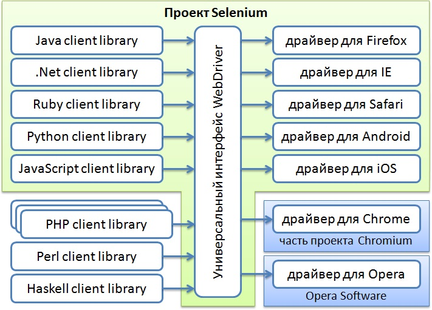

# Java_QA / Level 1. Easy - Основы / 1.1. Selenium WebDriver / Урок 01. Введение

## 1. Настройка окружения

Перед тем как начать автоматизировать тестовые сценарии необходимо подготовить окружение.

Рецепт следующий. Нам понадобятся:
* язык программирования;
* ide;
* сборщик проекта;
* система контроля версий;
* тестовый фреймворк;
* веб драйвер и менеджер драйверов;
* логирование;

### Язык программирования - Java (JDK)

В качестве языка программирования будет использоваться Java. 

#### Почему Java?

Разрабатывать автотесты можно и на других языках программирования - Python, Ruby, C#.
Однако стоит отметить ряд преимуществ:

* Java широко распространен в разработке (бек/микросервисы на фреймворке Spring, приложения для ОС Android);

Разработчики на Java смогут помочь в решении многих вопросов.

* Java давно используеся в автотестах;

Широкий наборо библоитек для автоматизации тестирования (в частности в C# нет аналога Selenide - 
библиотеки для более изящного написания кода для автотестов).

***Java*** – строго типизированный объектно-ориентированный язык программирования общего назначения, разработанный компанией Sun Microsystems (в последующем приобретённой компанией Oracle). 
Программы на Java транслируются в байт-код Java, выполняемый виртуальной машиной Java (JVM) — программой, обрабатывающей байтовый код и передающей инструкции оборудованию как интерпретатор.
Достоинством подобного способа выполнения программ является полная независимость байт-кода от операционной системы и оборудования, что позволяет выполнять Java-приложения на любом устройстве, 
для которого существует соответствующая виртуальная машина. 

#### Где взять Java?

На сайте [Oracle](https://www.oracle.com/java/technologies/javase-downloads.html)

#### Какую версию Java устанавливать?

Релизы Java выходят раз в полгода (не считая мелких обновлений). 
Но не стоит гнаться за новизной. Если вы установите Java последней версии, приготовьтесь к тому, что не все приложения будут хорошо работать с ней. 
Новые недавно добавленные возможности иногда приводят к проблемам совместимости.

В сентябре 2019 вышла версия 13, в 2020 вышла версия 15, но при этом большинство продолжает использовать Java 8! 
Поэтому если вы хотите максимальной стабильности и совместимости — берите Java 8.

Второе место по популярности занимает Java 11, это так называемый релиз с долгосрочной поддержкой (Long Term Support, LTS), ориентированный на корпоративных пользователей, для которых стабильность важнее новых фич.
Поддержка Java 8 официально прекращается в декабре 2020 года, к этому времени все корпоративные пользователи будут вынуждены перейти на Java 11.
 
Выбирая из 32-битной и 64-битной версий, берите 64-битную, если ваша операционная система это позволяет.

#### Что устанавливать, JRE или JDK?
  
***Java Development Kit, или JDK*** — это набор инструментов для разработки программ на языке программирования Java 
(компилятор, архиватор, генератор документации и прочие), среду выполнения (Java Runtime Environment), стандартную библиотеку языка, 
примеры и документацию.
  
***Java Runtime Environment, или JRE*** — это виртуальная машина, позволяющая запускать приложения, написанные на языке программирования Java.
  
*Правило очень простое:* если вы собираетесь что-нибудь писать на языке программирования Java, значит вам потребуется JDK. 
А если только запускать готовые программы — тогда достаточно JRE.

#### Как установить Java?

##### Установка Java Development Kit

Шаги:

1. Перейти на сайт [Oracle](https://www.oracle.com/java/technologies/javase-downloads.html) и загрузите JDK для вашей платформы.

2. Запустить exe файл.

3. В процессе установки выбрать «Development Tool» и нажать «Next».

Спустя некоторое время установка завершится.
Итак, Java Development Kit установлен, но это еще не всё. Необходимо настроить его для системы.

##### Настройка переменных сред

Инсталлятор Java выполняет минимальную необходимую настройку окружения, в том числе он добавляет в переменную среды PATH путь к директории, 
которая содержит исполняемые файлы Java (в операционной системе Windows), либо создаёт в стандартной директории для исполняемых файлов символические ссылки 
на установленные исполняемые файлы Java (в других операционных системах).

Но некоторые программы вместо этого используют переменную среды JAVA_HOME, которая должна указывать на директорию, в которую установлена Java. 
Поэтому на всякий случай можно сразу установить эту переменную.

Шаги:

1. Выполнить команду where java в консоли

```bat
C:\Users\DKim>where java
C:\Program Files\Java\jdk1.8.0_201\bin\java.exe
C:\ProgramData\Oracle\Java\javapath\java.exe
```

Эта команда вернёт путь к директории установки Java

2. Скопировать пути к директории установки Java

3. Открыть Панель управления -> Система, выбрать Дополнительные параметры системы




### IDE - IntelliJ IDEA

### Сборщик - Maven

### Система контроля версий - Git

## 2. Добавление библиотек

### Тестовый фреймворк - JUnit

### Веб драйвер - Selenium WebDriver

### Веб драйвер менеджер - WebDriverManager

### Логирование - Log4J

## 3. Написание и запуск первого автотеста

