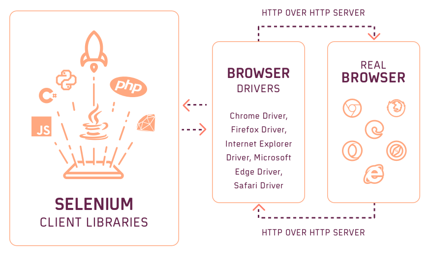
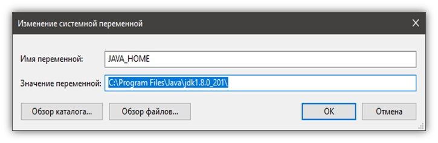

# Java_QA / Level 1. Easy - Основы / 1.1. Selenium WebDriver / Урок 01. Введение

## 1. Настройка окружения

Перед тем как начать автоматизировать тестовые сценарии необходимо подготовить окружение.

Рецепт следующий. Нам понадобятся:
* язык программирования;
* ide;
* сборщик проекта;
* система контроля версий;
* тестовый фреймворк;
* веб драйвер и менеджер драйверов;
* логирование;

### Язык программирования - Java (JDK)

В качестве языка программирования будет использоваться Java. 

#### Почему Java?

Разрабатывать автотесты можно и на других языках программирования - Python, Ruby, C#.
Однако стоит отметить ряд преимуществ:

* Java широко распространен в разработке (бек/микросервисы на фреймворке Spring, приложения для ОС Android);

Разработчики на Java смогут помочь в решении многих вопросов.

* Java давно используеся в автотестах;

Широкий наборо библоитек для автоматизации тестирования (в частности в C# нет аналога Selenide - 
библиотеки для более изящного написания кода для автотестов).

***Java*** – строго типизированный объектно-ориентированный язык программирования общего назначения, разработанный компанией Sun Microsystems (в последующем приобретённой компанией Oracle). 
Программы на Java транслируются в байт-код Java, выполняемый виртуальной машиной Java (JVM) — программой, обрабатывающей байтовый код и передающей инструкции оборудованию как интерпретатор.
Достоинством подобного способа выполнения программ является полная независимость байт-кода от операционной системы и оборудования, что позволяет выполнять Java-приложения на любом устройстве, 
для которого существует соответствующая виртуальная машина. 

#### Где взять Java?

На сайте [Oracle](https://www.oracle.com/java/technologies/javase-downloads.html)

#### Какую версию Java устанавливать?

Релизы Java выходят раз в полгода (не считая мелких обновлений). 
Но не стоит гнаться за новизной. Если вы установите Java последней версии, приготовьтесь к тому, что не все приложения будут хорошо работать с ней. 
Новые недавно добавленные возможности иногда приводят к проблемам совместимости.

В сентябре 2019 вышла версия 13, в 2020 вышла версия 15, но при этом большинство продолжает использовать Java 8! 
Поэтому если вы хотите максимальной стабильности и совместимости — берите Java 8.

Второе место по популярности занимает Java 11, это так называемый релиз с долгосрочной поддержкой (Long Term Support, LTS), ориентированный на корпоративных пользователей, для которых стабильность важнее новых фич.
Поддержка Java 8 официально прекращается в декабре 2020 года, к этому времени все корпоративные пользователи будут вынуждены перейти на Java 11.
 
Выбирая из 32-битной и 64-битной версий, берите 64-битную, если ваша операционная система это позволяет.

#### Что устанавливать, JRE или JDK?
  
***Java Development Kit, или JDK*** — это набор инструментов для разработки программ на языке программирования Java 
(компилятор, архиватор, генератор документации и прочие), среду выполнения (Java Runtime Environment), стандартную библиотеку языка, 
примеры и документацию.
  
***Java Runtime Environment, или JRE*** — это виртуальная машина, позволяющая запускать приложения, написанные на языке программирования Java.
  
*Правило очень простое:* если вы собираетесь что-нибудь писать на языке программирования Java, значит вам потребуется JDK. 
А если только запускать готовые программы — тогда достаточно JRE.

#### Как установить Java?

##### Установка Java Development Kit

Шаги:

1. Перейти на сайт [Oracle](https://www.oracle.com/java/technologies/javase-downloads.html) и загрузите JDK для вашей платформы.

2. Запустить exe файл.

3. В процессе установки выбрать «Development Tool» и нажать «Next».

Спустя некоторое время установка завершится.
Итак, Java Development Kit установлен, но это еще не всё. Необходимо настроить его для системы.

##### Настройка переменных сред

Инсталлятор Java выполняет минимальную необходимую настройку окружения, в том числе он добавляет в переменную среды PATH путь к директории, 
которая содержит исполняемые файлы Java (в операционной системе Windows), либо создаёт в стандартной директории для исполняемых файлов символические ссылки 
на установленные исполняемые файлы Java (в других операционных системах).

Но некоторые программы вместо этого используют переменную среды JAVA_HOME, которая должна указывать на директорию, в которую установлена Java. 
Поэтому на всякий случай можно сразу установить эту переменную.

Шаги:

1. Выполнить команду **where java** в консоли

```bash
where java
```

Эта команда вернёт путь к директории установки Java

```bash
C:\Program Files\Java\jdk1.8.0_201\bin\java.exe
C:\ProgramData\Oracle\Java\javapath\java.exe
```

2. Скопировать пути к директории установки Java

3. Открыть **Панель управления -> Система**, выбрать **Дополнительные параметры системы**


4. В появившемся окне нажать кнопку **Переменные среды**


5. В открывшемся окне в блоке **Системные переменные** нужно проверить существует ли переменная **PATH**


6. Если переменная **PATH** не существует, то ее нужно создать, нажав на кнопку **Создать**


7. Если переменная **PATH** уже существует, то ее нужно изменить, нажав на кнопку **Изменить**



8. Для переменной **PATH** нужно установить Значение переменной — скопированный ранее путь к каталогу (%JAVA_HOME%\bin), в который была установлена Java (из шага 1)


9. Подобным образом создается/изменяется переменная **JAVA_HOME**.  Значение этой переменной — путь к каталогу, в который была установлена Java (как для PATH), но уже без поддиректории **bin**


То есть будет примерно так

* Значение в **PATH**: C:\Program Files\Java\jdk1.7.0_25\bin

* Значение в **JAVA_HOME**: C:\Program Files\Java\jdk1.7.0_25

После того, как были прописаны переменные, установку Java можно считать завершенной!

#### Как проверить правильность установки?

Теперь самое важное – необходимо убедиться, что Java установлена и настроена корректно.

Шаги: 

1.	Открыть командную строку 

2.	Выполнить команду **javac**, чтобы убедиться, что JRE установлен и настроен

```bash
javac
```

Если выдаётся список аргументов к команде **javac**, то успешно установлено и настроено все, что необходимо для использования Java!

```bash
Usage: javac <options> <source files>
where possible options include:
  -g                         Generate all debugging info
  -g:none                    Generate no debugging info
  -g:{lines,vars,source}     Generate only some debugging info
  -nowarn                    Generate no warnings
  -verbose                   Output messages about what the compiler is doing
  -deprecation               Output source locations where deprecated APIs are used
  -classpath <path>          Specify where to find user class files and annotation processors
  -cp <path>                 Specify where to find user class files and annotation processors
  -sourcepath <path>         Specify where to find input source files
  -bootclasspath <path>      Override location of bootstrap class files
  -extdirs <dirs>            Override location of installed extensions
  -endorseddirs <dirs>       Override location of endorsed standards path
  -proc:{none,only}          Control whether annotation processing and/or compilation is done.
  -processor <class1>[,<class2>,<class3>...] Names of the annotation processors to run; bypasses default discovery process
  -processorpath <path>      Specify where to find annotation processors
  -parameters                Generate metadata for reflection on method parameters
  -d <directory>             Specify where to place generated class files
  -s <directory>             Specify where to place generated source files
  -h <directory>             Specify where to place generated native header files
  -implicit:{none,class}     Specify whether or not to generate class files for implicitly referenced files
  -encoding <encoding>       Specify character encoding used by source files
  -source <release>          Provide source compatibility with specified release
  -target <release>          Generate class files for specific VM version
  -profile <profile>         Check that API used is available in the specified profile
  -version                   Version information
  -help                      Print a synopsis of standard options
  -Akey[=value]              Options to pass to annotation processors
  -X                         Print a synopsis of nonstandard options
  -J<flag>                   Pass <flag> directly to the runtime system
  -Werror                    Terminate compilation if warnings occur
  \@<filename>                Read options and filenames from file
```

3. Выполнить команду **where java**, которая должна показать правильный путь до исполняемого файла java.exe

```bash
where java
```

Эта команда вернёт путь к директории установки Java

```bash
C:\Program Files\Java\jdk1.8.0_201\bin\java.exe
C:\ProgramData\Oracle\Java\javapath\java.exe
```

4. Выполнить команду **java -version** для проверки того, что это именно та версия, которую устанавливали

```bash
java -version
```

Эта команда вернет версию Java, которую устанавливали

```bash
java version "1.8.0_201"
Java(TM) SE Runtime Environment (build 1.8.0_201-b09)
Java HotSpot(TM) 64-Bit Server VM (build 25.201-b09, mixed mode)
```

### IDE - IntelliJ IDEA

#### Почему IntelliJ IDEA?

Существует множество разных IDE. Но среди всех IDE IntelliJ IDEA обладает рядом преимуществ, 
таких как простота и удобство (быстрое автозаполнение, исправление, эффективный рефакторинг). 
К примеру, установка дополнительных плагинов в Eclipse может стать настоящим квестом. 


**IntelliJ IDEA** — известная IDE для Java, написанная, как ни странно, на Java. 
Укомплектована уникальными инструментами и позволяет без проблем ориентироваться в программе. 
Нахождение ошибок и отладка кода никогда не были такими легкими, как с IntelliJ IDEA.

Существует две версии IntelliJ IDEA – **Community** и **Ultimate**. 
Первая – бесплатная, но ограниченная. В ней не поддерживаются фреймворки Spring, Vaadin, GWT, языки JavaScript и TypeScript, SQL и многое другое. 
Вторая включает в себя всевозможные фичи для коллективной разработки, но бесплатна будет только 30 дней пробного периода. 
Потом вам придётся заплатить минимум 500 долларов США



#### Как установить IntelliJ IDEA?

##### Установка IntelliJ IDEA

Шаги:

1. Скачать исходник с расширением exe. с сайта [Jetbrains](https://www.jetbrains.com/idea/download/#section=windows)

2. Запустить его и следовать инструкциям установщика


#### Предварительная  настройка IntelliJ IDEA

После установки IntelliJ IDEA, необходимо выполнить предварительную настройку 

Шаги:

1. Указать путь до настроек

При первом запуске IntelliJ IDEA перед вами выскочит диалоговое окно с требованием указать путь до файла с настройками. 
Так как это первый опыт знакомства с IDE, то выбрать пункт «Do not import settings». 
Если данное окно вылезло после обновления или переустановки – выбрать исходную директорию.


### Сборщик - Maven

### Система контроля версий - Git

## 2. Добавление библиотек

### Тестовый фреймворк - JUnit

### Веб драйвер - Selenium WebDriver

### Веб драйвер менеджер - WebDriverManager

### Логирование - Log4J

## 3. Написание и запуск первого автотеста

