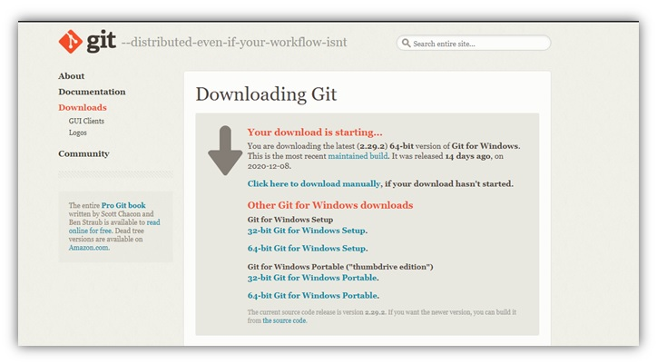
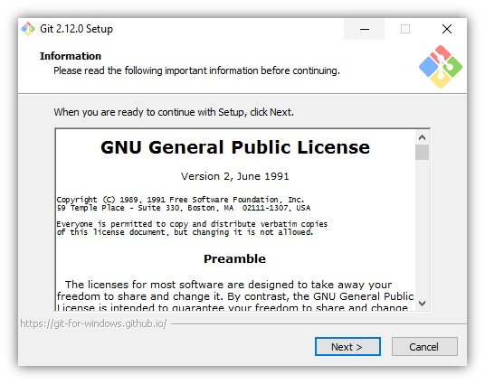

# Java_QA / Level 1. Easy - Основы / 1.1. Selenium WebDriver / Урок 01. Введение

[](README.md)
[](2.%20Практика.md)

***

Перед тем как начать автоматизировать тестовые сценарии необходимо установить компоненты и подключить либы.

Рецепт следующий. Нам понадобятся:

* язык программирования
* ide
* сборщик проекта
* система контроля версий
* тестовый фреймворк
* веб драйвер 
* менеджер драйверов
* логирование

***

## 1. Настройка окружения

Установить:

* язык программирования - Java
* ide - IntelliJ IDEA
* сборщик проекта - Maven
* система контроля версий - Git

Создать учетку в Github.

### 1.1. Язык программирования Java (JDK)

В качестве языка программирования будет использоваться Java. 

#### 1.1.1. Почему Java?

***Java*** – строго типизированный объектно-ориентированный язык программирования общего назначения, разработанный компанией Sun Microsystems (в последующем приобретённой компанией Oracle). 
Программы на Java транслируются в байт-код Java, выполняемый виртуальной машиной Java (JVM) — программой, обрабатывающей байтовый код и передающей инструкции оборудованию как интерпретатор.
Достоинством подобного способа выполнения программ является полная независимость байт-кода от операционной системы и оборудования, что позволяет выполнять Java-приложения на любом устройстве, 
для которого существует соответствующая виртуальная машина.

Преимущества:

* Java широко распространен в разработке (бек/микросервисы на фреймворке Spring, приложения для ОС Android)

Разработчики на Java смогут помочь в решении многих вопросов.

* Java давно используеся в автотестах

Широкий набор библиотек для автоматизации тестирования (в частности в C# нет аналога Selenide - 
библиотеки для более изящного написания кода для автотестов).

*Стек*: JUnit, TestNG, Selenide, Cucumber.

Разрабатывать автотесты можно и на других языках программирования:
 
* Python
* Ruby
* C#

Рассмотрим подробнее:

**Python** 

Простой синтаксис (и нет проклятых операторных скобок), колоссальное количество библиотек, огромное коммьюнити.

*Стек*: PyTest, PyTest BDD, Behave.

**Ruby** 

Удобный и гибкий синтаксис (и нет проклятых операторных скобок), множество библиотек, сильное развитие инструментов тестирования (в частности изначально BDD фреймворк Cucumber разрабатывался на Ruby).

*Стек*: RSpec, Capybara, Cucumber.

**C#** 

Поддержка Microsoft, Си подобный синтаксис (с проклятыми операторными скобками).

*Стек*: NUnit, SpecFlow.

Каждый из языков программирования обладает примерно равными возможностями, а выбор конкретного языка - это уже вопрос предпочтений.

#### 1.1.2. Где взять Java?

На сайте [Oracle](https://www.oracle.com/java/technologies/javase-downloads.html)

#### 1.1.3. Какую версию Java устанавливать?

Релизы Java выходят раз в полгода (не считая мелких обновлений). 
Но не стоит гнаться за новизной. Если вы установите Java последней версии, приготовьтесь к тому, что не все приложения будут хорошо работать с ней. 
Новые недавно добавленные возможности иногда приводят к проблемам совместимости.

В сентябре 2019 вышла версия 13, в 2020 вышла версия 15, но при этом большинство продолжает использовать Java 8! 
Поэтому если вы хотите максимальной стабильности и совместимости — берите Java 8.

Второе место по популярности занимает Java 11, это так называемый релиз с долгосрочной поддержкой (Long Term Support, LTS), ориентированный на корпоративных пользователей, для которых стабильность важнее новых фич.
Поддержка Java 8 официально прекращается в декабре 2020 года, к этому времени все корпоративные пользователи будут вынуждены перейти на Java 11.
 
Выбирая из 32-битной и 64-битной версий, берите 64-битную, если ваша операционная система это позволяет.

#### 1.1.4. Что устанавливать, JRE или JDK?
  
***Java Development Kit, или JDK*** — это набор инструментов для разработки программ на языке программирования Java 
(компилятор, архиватор, генератор документации и прочие), среду выполнения (Java Runtime Environment), стандартную библиотеку языка, 
примеры и документацию.
  
***Java Runtime Environment, или JRE*** — это виртуальная машина, позволяющая запускать приложения, написанные на языке программирования Java.
  
*Правило очень простое:* если вы собираетесь что-нибудь писать на языке программирования Java, значит вам потребуется JDK. 
А если только запускать готовые программы — тогда достаточно JRE.

#### 1.1.5. Как установить Java?

##### 1.1.5.1. Установка Java Development Kit

Шаги:

1. Перейти на сайт [Oracle](https://www.oracle.com/java/technologies/javase-downloads.html) и загрузите JDK для вашей платформы.

2. Запустить exe файл.

3. В процессе установки выбрать «Development Tool» и нажать «Next».

Спустя некоторое время установка завершится.
Итак, Java Development Kit установлен, но это еще не всё. Необходимо настроить его для системы.

##### 1.1.5.2. Настройка переменных сред

Инсталлятор Java выполняет минимальную необходимую настройку окружения, в том числе он добавляет в переменную среды PATH путь к директории, 
которая содержит исполняемые файлы Java (в операционной системе Windows), либо создаёт в стандартной директории для исполняемых файлов символические ссылки 
на установленные исполняемые файлы Java (в других операционных системах).

Но некоторые программы вместо этого используют переменную среды JAVA_HOME, которая должна указывать на директорию, в которую установлена Java. 
Поэтому на всякий случай можно сразу установить эту переменную.

Шаги:

1. Выполнить команду **where java** в консоли.

```bash
where java
```

Эта команда вернёт путь к директории установки Java.

```bash
C:\Program Files\Java\jdk1.8.0_201\bin\java.exe
C:\ProgramData\Oracle\Java\javapath\java.exe
```

2. Скопировать пути к директории установки Java.

3. Открыть **Панель управления -> Система**, выбрать **Дополнительные параметры системы**.


4. В появившемся окне нажать кнопку **Переменные среды**.


5. В открывшемся окне в блоке **Системные переменные** нужно проверить существует ли переменная **PATH**.


6. Если переменная **PATH** не существует, то ее нужно создать, нажав на кнопку **Создать**.


7. Если переменная **PATH** уже существует, то ее нужно изменить, нажав на кнопку **Изменить**.


8. Для переменной **PATH** нужно установить Значение переменной — скопированный ранее путь к каталогу (%JAVA_HOME%\bin), в который была установлена Java (из шага 1).


9. Подобным образом создается/изменяется переменная **JAVA_HOME**.  Значение этой переменной — путь к каталогу, в который была установлена Java (как для PATH), но уже без поддиректории **bin**.


То есть будет примерно так:

* Значение в **PATH**: C:\Program Files\Java\jdk1.7.0_25\bin

* Значение в **JAVA_HOME**: C:\Program Files\Java\jdk1.7.0_25

10. Готово! Установка Java завершена.

#### 1.1.6. Как проверить правильность установки?

Теперь самое важное – необходимо убедиться, что Java установлена и настроена корректно.

Шаги: 

1.	Открыть командную строку.

2.	Выполнить команду **javac**, чтобы убедиться, что JRE установлен и настроен.

```bash
javac
```

Если выдаётся список аргументов к команде **javac**, то успешно установлено и настроено все, что необходимо для использования Java!

```bash
Usage: javac <options> <source files>
where possible options include:
  -g                         Generate all debugging info
  -g:none                    Generate no debugging info
  -g:{lines,vars,source}     Generate only some debugging info
  -nowarn                    Generate no warnings
  -verbose                   Output messages about what the compiler is doing
  -deprecation               Output source locations where deprecated APIs are used
  -classpath <path>          Specify where to find user class files and annotation processors
  -cp <path>                 Specify where to find user class files and annotation processors
  -sourcepath <path>         Specify where to find input source files
  -bootclasspath <path>      Override location of bootstrap class files
  -extdirs <dirs>            Override location of installed extensions
  -endorseddirs <dirs>       Override location of endorsed standards path
  -proc:{none,only}          Control whether annotation processing and/or compilation is done.
  -processor <class1>[,<class2>,<class3>...] Names of the annotation processors to run; bypasses default discovery process
  -processorpath <path>      Specify where to find annotation processors
  -parameters                Generate metadata for reflection on method parameters
  -d <directory>             Specify where to place generated class files
  -s <directory>             Specify where to place generated source files
  -h <directory>             Specify where to place generated native header files
  -implicit:{none,class}     Specify whether or not to generate class files for implicitly referenced files
  -encoding <encoding>       Specify character encoding used by source files
  -source <release>          Provide source compatibility with specified release
  -target <release>          Generate class files for specific VM version
  -profile <profile>         Check that API used is available in the specified profile
  -version                   Version information
  -help                      Print a synopsis of standard options
  -Akey[=value]              Options to pass to annotation processors
  -X                         Print a synopsis of nonstandard options
  -J<flag>                   Pass <flag> directly to the runtime system
  -Werror                    Terminate compilation if warnings occur
  \@<filename>                Read options and filenames from file
```

3. Выполнить команду **where java**, которая должна показать правильный путь до исполняемого файла java.exe.

```bash
where java
```

Эта команда вернёт путь к директории установки Java.

```bash
C:\Program Files\Java\jdk1.8.0_201\bin\java.exe
C:\ProgramData\Oracle\Java\javapath\java.exe
```
4. Выполнить команду **java -version** для проверки того, что это именно та версия, которую устанавливали.

```bash
java -version
```

Эта команда вернет версию Java, которую устанавливали.

```bash
java version "1.8.0_201"
Java(TM) SE Runtime Environment (build 1.8.0_201-b09)
Java HotSpot(TM) 64-Bit Server VM (build 25.201-b09, mixed mode)
```

***

### 1.2. IDE IntelliJ IDEA

#### 1.2.1. Почему IntelliJ IDEA?

***IntelliJ IDEA*** — известная IDE для Java, написанная, как ни странно, на Java. 
Укомплектована уникальными инструментами и позволяет без проблем ориентироваться в программе. 
Нахождение ошибок и отладка кода никогда не были такими легкими, как с IntelliJ IDEA.

Преимущества:

* глубокий анализ кода
    * умное автодополнение
    * автодополнение цепочек вызовов
    * автодополнение статических членов
    * анализ потоков данных
    * языковые вставки
    * рефакторинги для разных языков
    * поиск дубликатов
    * инспекции и быстрые исправления
* эргономичная среда
    * все необходимое прямо в редакторе
    * сочетания клавиш для любого действия
    * эргономичный интерфейс
    * встроенный отладчик
* встроенные инструменты для разработчиков
    * интеграция с системами контроля версий
    * инструменты сборки
    * инструмент запуска тестов и анализ покрытия кода
    * декомпилятор
    * терминал
    * инструменты для работы с базами данных
    * интеграция с серверами приложений
    * Docker
* разработка на разных языках
    * поддержка лучших фреймворков
    * универсальная IDE для разных языков
    * богатая экосистема плагинов 

Существует две версии IntelliJ IDEA – **Community** и **Ultimate**. 


**IntelliJ Community Edition** - бесплатная версия.

Для начинающих программистов бесплатная IDE предоставляет широкие возможностями, которые помогут им сделать первые шаги в веб-разработке на Java. 

*Языки*: Java, Groovy, Kotlin, Scala, Go, Dart, Erlang и Python.

*Фреймворки и платформы*: Android, Swing и JavaFX.

*Системы контроля версий*: Git/GitHub, SVN, Mercurial и CVS. 

Кроме этого данная IDE является довольно компактной и содержит несколько других функций, таких как:
 
* выполнение тестов JUnit/TestNG
* отладка
* автоматическое завершение кода
* проверка кода, рефакторинг кода
* визуальный графический редактор GUI

Доступен плагин Docker, обеспечивающий поддержку развертывания веб-приложений. 
Бесплатная версия также включает в себя Decompiler и ByteCode для выполнения расширенного анализа.

**IntelliJ Ultimate Edition** - платная версия.

Более продвинутые пользователи, скорее всего, предпочтут платную версию, которая дает возможность использовать продвинутые функции.
Платная версия включает в себя всевозможные фичи для коллективной разработки, но бесплатна будет только 30 дней пробного периода. 
Потом вам придётся заплатить минимум 500 долларов США.

*Языки*: все что бесплатная + JavaScript, TypeScript, SQL, CSS, LESS, Sass, Stylus, CoffeeScript, ActionScript, Ruby и PHP.

*Фреймворки и платформы*: все что бесплатная + Spring MVC, J2EE (JSF/JAX-RS/CDI/JPA), Grails, Griffin, React, Angular JS, Node.js, Django, Flask, Drupal, WordPress, Laravel.

*Системы контроля версий*: все что бесплатная + TFS, Perforce, ClearCase и Visual SourceSafe.

В ней доступно множество вариантов настройки стратегии развертывания с использованием Tomcat, TomEE, GAE, GlassFish, JBoss, WebLogic, WebSphere, Geronimo, Jetty и Virgo.
В этой версии реализована поддержка NPM, WebPack, Gulp и Grunt. 
Она включает в себя такие инструменты, как диаграммы (UML / Dependencies), матрица зависимостей.

В качестве IDE можно взять:

* Eclipse
* NetBeans
* JDeveloper

Однако все они уступают по возможностям даже бесплатной версии IntelliJ.

#### 1.2.2. Как установить IntelliJ IDEA?

##### 1.2.2.1. Установка IntelliJ IDEA

Шаги:

1. Скачать исходник с расширением exe. с сайта [Jetbrains](https://www.jetbrains.com/idea/download/#section=windows)

2. Запустить его и следовать инструкциям установщика.


3. Готово! Установка IntelliJ IDEA завершена.

##### 1.2.2.2. Предварительная настройка IntelliJ IDEA

После установки IntelliJ IDEA, необходимо выполнить предварительную настройку.

Шаги:

1. Указать путь до настроек.

При первом запуске IntelliJ IDEA перед вами выскочит диалоговое окно с требованием указать путь до файла с настройками. 
Так как это первый опыт знакомства с IDE, то выбрать пункт «Do not import settings». 
Если данное окно вылезло после обновления или переустановки – выбрать исходную директорию.


2. Выбрать тему.

Следующим шагом настройки IntelliJ IDEA будет выбор темы. ПО умолчанию их две – стандартная (светлая) и Darcula (тёмная).


3. Отключить вспомогательные инструменты.

Как уже было написано выше, IDEA поддерживает огромное количество вспомогательных инструментов. Разумеется, новичку они все не нужны. 
Поэтому следующим шагом будет их отключение для увеличения производительности. Для этого в очередном диалоговом окне выбрать «Disable All». 
Не переживайте, их можно подключить позднее в меню настроек.


4. Завершение установки и настройки.

Теперь, когда с установкой и настройкой IntelliJ IDEA покончено, можно приступить к работе. Начинается она, разумеется, 
с создания IntelliJ IDEA проекта.


***

### 1.3. Сборщик Maven

#### 1.3.1. Почему Maven?

***Apache Maven*** — система управления жизненным циклом проекта, фреймворк для автоматизации сборки проектов на основе описания их структуры в файлах на языке POM 
(англ. Project Object Model), являющемся подмножеством XML. Проект Maven издаётся сообществом Apache Software Foundation, 
где формально является частью Jakarta Project.

Преимущества:

* декларативный язык описания проекта (POM)
* автоматическое управление зависимостями
* огромный, поддерживаемый в актуальном состоянии репозиторий артефактов
* модульная расширяемая за счет плагинов архитектура, огромное количество плагинов

В качестве сборщика можно взять:

* Ant
* Gradle

Рассмотрим подробнее:

**Ant**

Ant - cамый древний сборщик, ограничения Ant привели к созданию Maven

**Gradle**

Gradle - самое лучшее от Ant и Maven.
Однако Gradle использует DSL на основе Groovy, что потребует изучение еще одного языка программирования.
Также у Gradle нет собственной инфраструктуры, это просто сборщик. 
И если вы решили разрабатывать библиотеку на Gradle, то придётся не только загружать её в Maven-репозиторий, но генерировать и сам pom.xml.

#### 1.3.2. Как установить Maven? 

Шаги:

1. Установить Java.

2. Скачать архив с официального сайта [Maven](https://maven.apache.org/download.cgi).


3. Распаковать скачанный архив в папку.

4. Установить переменной окружения **M2_HOME** ссылку на местонахождение распакованного архива

5. Установить еще одну переменную **M2** со значением **%M2_HOME%\bin**.

6. Установить или добавить в переменную **Path** значение **%M2%**, чтобы наша папочка с исполняемым файлом Maven была видна из командной строки

7. Готово! Установка Maven завершена.

#### 1.3.3. Как проверить правильность установки Maven?

Шаги:

1. Выполнить команду в командной строке **mvn –v**.

```bash
mvn –v
```

2. Если отобразится информация о Maven, то значит, что процесс установки завершен успешно. Все готово к работе

***

### 1.4. Система контроля версий Git

#### 1.4.1. Почему Git?

***Git*** – распределённая система контроля версий, позволяющая сохранять изменения, внесённые в файлы, которые хранятся в репозитории. 

Преимущества:

* бесплатный и open-source

Это значит, что его можно бесплатно скачать и вносить любые изменения в исходный код.
  
* небольшой и быстрый

Он выполняет все операции локально, что увеличивает его скорость. Кроме того, Git локально сохраняет весь репозиторий в небольшой файл без потери качества данных.
  
* резервное копирование

Git эффективен в хранении бэкапов, поэтому известно мало случаев, когда кто-то терял данные при использовании Git.

* простое ветвление. 

В других СКВ создание веток— утомительная и трудоёмкая задача, так как весь код копируется в новую ветку. 
В Git управление ветками реализовано гораздо проще и эффективнее.

В качестве системы контроля версий можно взять:

* SVN
* Mercurial

Рассмотрим подробнее:

**SVN**

*Преимущества*:

* допускает атомарные операции
* операции с ветвлением кода менее затратны
* широкий выбор плагинов IDE
* не использует пиринговую модель

*Недостатки*:

* все еще сохраняются ошибки, связанные с переименованием файлов и директорий
* неудовлетворительный набор команд для работы с репозиторием
* сравнительно небольшая скорость

**Mercurial**

*Преимущества*:

* по сравнению с Git легче в освоении
* подробная документация
* распределенная модель системы контроля версий

*Недостатки*:

* нет возможности слияния двух родительских веток
* использование плагинов, а не скриптов
* меньше возможностей для нестандартных решений

#### 1.4.2. Как установить Git?

##### 1.4.2.1. Установка Git

Шаги:

1. Скачать последнюю версию программы с [сайта](https://git-scm.com/download/win).



2. Запустить программу установки.


3. После успешного запуска программы установки отобразится экран мастера установки Git. 
Для завершения установки следуйте инструкциям, нажимая кнопки Далее и Готово. 
Параметры по умолчанию достаточно хорошо подходят для большинства пользователей.



##### 1.4.2.2. Настройка Git

Настройка системы Git предполагает, в первую очередь, указание имени пользователя и e-mail, 
которые используются для подписи коммитов и отправки изменений в удаленный репозиторий.

#### 1.4.3. Как проверить правильность установки Git?

В командной строке набрать и выполнить команду **git –-version**

```bash
git –-version
```

Если все ок, то в консоли будет выведена версия установленного **Git**

```bash
git version 2.26.2.windows.1
```

***

### 1.5. GitHub

#### 1.5.1. Почему GitHub?

***GitHub*** — сервис онлайн-хостинга репозиториев, обладающий всеми функциями распределённого контроля версий и функциональностью управления исходным кодом — всё, что поддерживает Git и даже больше. 

Цель GitHub — содействовать взаимодействию разработчиков.

Преимущества:

* контроль доступа
* багтрекинг
* управление задачами
* вики для каждого проекта
* интеграция со множеством популярных сервисов
* графики
* вложенные списки задач

#### 1.5.2. Как зарегистрироваться на GitHub?

Шаги:

1. Перейти на сайт [GutHub](https://github.com/)


2. Нажать кнопку **Sign up** 

3. На странице регистрации ввести обязательные данные:
   
    * имя пользователя
    * адрес электронной почты
    * пароль


4. На указанную ранее почту придёт письмо с просьбой подтвердить электронный адрес. 
Для завершения регистрации пройдите по полученной ссылке. 

5. Готово! Аккаунт для Гитхаба создан.

***

## 2. Добавление библиотек

Подключить следующие зависимости:

* тестовый фреймворк - JUnit 5
* веб драйвер - Selenium WebDriver 
* менеджер драйверов - WebDriverManager
* логирование - Log4J2

***

### 2.1. Тестовый фреймворк JUnit 5

#### 2.1.1. Почему JUnit5?

***JUnit5*** — это мощное и гибкое обновление фреймворка JUnit, которое предоставляет множество улучшений и новых функций для написания тестов. 

В Java есть несколько широко используемых тестовых фреймворков - JUnit4, JUnit5 и TestNG.
На текущий момент JUnit4 считается устаревшим, взамен ему вышла новая версия JUnit5. 
А вот и JUnit5 и TestNG являются современными инструментами для тестирования в экосистеме Java и предоставляют практически схожие возможности.

[Сравнение тестовых фреймворков JUnit5 и TestNG](JUnitVersusTestNG.md)

#### 2.1.2. Как подключить JUnit?

В POM.xml добавить следующую зависимость

```xml
<dependency>
    <groupId>org.junit.jupiter</groupId>
    <artifactId>junit-jupiter-engine</artifactId>
    <version>5.1.0</version>
    <scope>test</scope>
</dependency>
```

***

### 2.2. Веб драйвер Selenium WebDriver

#### 2.2.1. Почему Selenium WebDriver?

**Selenium Webdriver** - инструмент для автоматизации реального браузера, как локально, так и удалённо, 
наиболее близко имитирующий действия пользователя.

**Selenium WebDriver** – спецификация интерфейса для управления браузером.

Существуют различные обертки поверх API Selenium - такие как Selenide. Но нет полноценных аналогов.

#### 2.2.2. Как подключить Selenium WebDriver?

В POM.xml добавить следующую зависимость

```xml
<dependency>
    <groupId>org.seleniumhq.selenium</groupId>
    <artifactId>selenium-java</artifactId>
    <version>3.141.59</version>
</dependency>
```

***

### 2.3. Менеджер веб драйверов WebDriverManager

#### 2.3.1. Почему WebDriverManager?

**WebDriverManager** - библиотека, которая позволяет автоматизировать управление драйверами. 

Без нее необходимо скачивать драйвер для каждого файла и в коде прописывать путь до исполняемого файла

```java
System.setProperty("webdriver.chrome.driver", "/path/to/chromedriver");
```

#### 2.3.2. Как подключить WebDriverManager?

В POM.xml добавить следующую зависимость

```xml
<dependency>
    <groupId>io.github.bonigarcia</groupId>
    <artifactId>webdrivermanager</artifactId>
    <version>4.2.0</version>
</dependency>
```

***

### 2.4. Логирование Log4J2

#### 2.4.1. Почему Log4j2?

**Log4j2** — библиотека журналирования (логирования) Java-программ, часть общего проекта «Apache Logging Project».

Из известных решений по логированию в Java можно выделить:

* log4j
* JUL — java.util.logging
* JCL — jakarta commons logging
* Logback
* SLF4J — simple logging facade for java

Рассмотрим подробнее:

**Log4j**

Это уже было полноценное решение, которое создавалось из потребностей разработчиков. 
Получился действительно интересный инструмент, который можно использовать. 
В силу разных обстоятельств это решение так и не попало в JDK, чем очень расстроило все комьюнити. 
log4j добавил такое понятие как appender, то есть инструмент, с помощью которого записываются логи и layout — форматирование логов. 
Это позволяет записывать только то, что нужно и как нужно.

**JUL — java.util.logging**

Одно из ключевых преимуществ это решения — JUL включен в JDK (Java development kit). 
К сожалению, при его разработке за основу взяли не популярный log4j, а решение от IBM, что и повлияло на его развитие. 
По факту на данный момент JUL есть, но им никто не пользуется.

**JCL — jakarta commons logging**

Из-за того, что долгое время не было промышленного стандарта в логировании и был период, когда многие создавали свой кастомный логгер, 
решили выпустить JCL — общую обертку, которая  использовалась бы над другими. 
Почему? Когда в проект добавлялись какие-то зависимости, они могли использовать логгер, отличный от логгера на проекте. 
Из-за этого они транзитивно добавлялись в проект, что создавало реальные проблемы при попытке все это собрать воедино.
К сожалению, обертка была очень бедна на функциональность и никаких дополнений не вносила.
На данный момент применять JCL — не лучшая идея.

**Logback**

Logback написал тот же разработчик, что и log4j, чтобы создать ему преемника. В основе была та же идея, что и в log4j. 
Стандартно logback не требует каких-либо настроек и записывает все логи начиная от уровня DEBUG и выше. 
Если нужна настройка, ее можно выполнить через xml конфигурацию.

**SLF4J — simple logging facade for java**

Где-то в 2006 году один из отцов-основателей log4j вышел из проекта и создал slf4j — 
Simple Logging Facade for Java — обертку вокруг log4j, JUL, common-loggins и logback.
Причем она делится на две части: API, который используется в приложении и реализация, 
которая добавляется отдельными зависимостями для каждого вида логирования. 
SJF4J стал быстро расти в популярности, и на данный момент это лучшее решение.

Поэтому будем рассматривать логирование на примере связки slf4j-log4j12.

#### 2.4.2. Как подключить Log4J2?

В POM.xml добавить следующую зависимость

```xml
<dependencies>
    <dependency>
        <groupId>org.apache.logging.log4j</groupId>
        <artifactId>log4j-api</artifactId>
        <version>2.14.0</version>
    </dependency>
    <dependency>
        <groupId>org.apache.logging.log4j</groupId>
        <artifactId>log4j-core</artifactId>
        <version>2.14.0</version>
    </dependency>
</dependencies>
```

## 3. Написание и запуск первого автотеста

И так, после того как все что нужно установлено можно приступить к созданию первого проекта, написанию и запуску первого автотеста.

