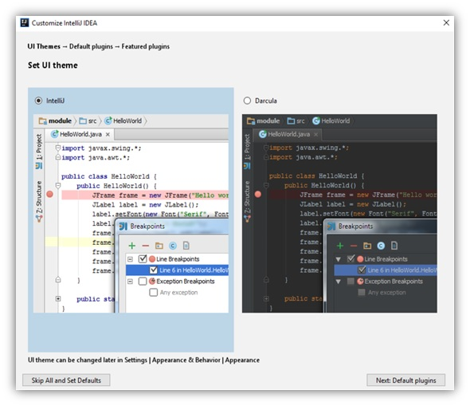
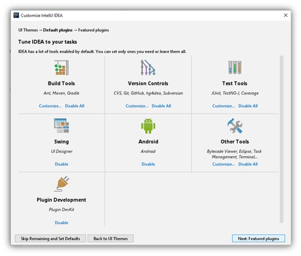
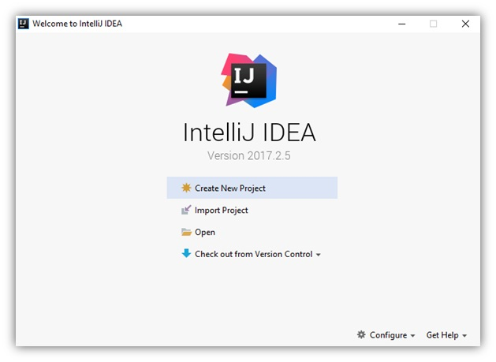

# Java_QA / Level 1. Easy - Основы / 1.1. Selenium WebDriver / Урок 01. Введение

[](1.%20Лекция.md)
[](README.md)
[](3.%20Задание.md)

***

## 1. Настройка окружения

### 1.1. Установка Java

#### 1.1.1. Как установить Java?

##### 1.1.1.1. Установка Java Development Kit

Шаги:

1. Перейти на сайт [Oracle](https://www.oracle.com/java/technologies/javase-downloads.html) и загрузите JDK для вашей платформы.

2. Запустить exe файл.

3. В процессе установки выбрать **Development Tool** и нажать **Next**.

Спустя некоторое время установка завершится.
Итак, Java Development Kit установлен, но это еще не всё. Необходимо настроить его для системы.

##### 1.1.1.2. Настройка переменных сред

Инсталлятор Java выполняет минимальную необходимую настройку окружения, в том числе он добавляет в переменную среды PATH путь к директории, 
которая содержит исполняемые файлы Java (в операционной системе Windows), либо создаёт в стандартной директории для исполняемых файлов символические ссылки 
на установленные исполняемые файлы Java (в других операционных системах).

Но некоторые программы вместо этого используют переменную среды JAVA_HOME, которая должна указывать на директорию, в которую установлена Java. 
Поэтому на всякий случай можно сразу установить эту переменную.

Шаги:

1. Выполнить команду **where java** в консоли.

```bash
where java
```

Эта команда вернёт путь к директории установки Java.

```bash
C:\Program Files\Java\jdk1.8.0_201\bin\java.exe
C:\ProgramData\Oracle\Java\javapath\java.exe
```

2. Скопировать пути к директории установки Java.

3. Открыть **Панель управления -> Система**, выбрать **Дополнительные параметры системы**.


4. В появившемся окне нажать кнопку **Переменные среды**.


5. В открывшемся окне в блоке **Системные переменные** нужно проверить существует ли переменная **PATH**.


6. Если переменная **PATH** не существует, то ее нужно создать, нажав на кнопку **Создать**.


7. Если переменная **PATH** уже существует, то ее нужно изменить, нажав на кнопку **Изменить**.


8. Для переменной **PATH** нужно установить Значение переменной — скопированный ранее путь к каталогу (**%JAVA_HOME%\bin**), в который была установлена Java (из шага 1).


9. Подобным образом создается/изменяется переменная **JAVA_HOME**.  Значение этой переменной — путь к каталогу, в который была установлена Java (как для PATH), но уже без поддиректории **bin**.


То есть будет примерно так:

* Значение в **PATH**: C:\Program Files\Java\jdk1.7.0_25\bin

* Значение в **JAVA_HOME**: C:\Program Files\Java\jdk1.7.0_25

10. Готово! Установка Java завершена.

#### 1.1.2. Как проверить правильность установки Java?

Шаги: 

1.	Открыть командную строку.

2.	Выполнить команду **javac**, чтобы убедиться, что JRE установлен и настроен.

```bash
javac
```

Если выдаётся список аргументов к команде **javac**, то успешно установлено и настроено все, что необходимо для использования Java!

3. Выполнить команду **where java**, которая должна показать правильный путь до исполняемого файла java.exe.

```bash
where java
```

Эта команда вернёт путь к директории установки Java.

```bash
C:\Program Files\Java\jdk1.8.0_201\bin\java.exe
C:\ProgramData\Oracle\Java\javapath\java.exe
```

4. Выполнить команду **java -version** для проверки того, что это именно та версия, которую устанавливали.

```bash
java -version
```

Эта команда вернет версию Java, которую устанавливали.

```bash
java version "1.8.0_201"
Java(TM) SE Runtime Environment (build 1.8.0_201-b09)
Java HotSpot(TM) 64-Bit Server VM (build 25.201-b09, mixed mode)
```

***

### 1.2. Установка IntelliJ IDEA

#### 1.2.2. Как установить IntelliJ IDEA?

##### 1.2.2.1. Установка IntelliJ IDEA

Шаги:

1. Скачать исходник с сайта [JetBrains](https://www.jetbrains.com/idea/download/#section=windows)

2. Запустить его и следовать инструкциям установщика.


3. Готово! Установка IntelliJ IDEA завершена.

##### 1.2.2.2. Предварительная настройка IntelliJ IDEA

После установки IntelliJ IDEA, необходимо выполнить предварительную настройку.

Шаги:

1. Указать путь до настроек.

При первом запуске IntelliJ IDEA перед вами выскочит диалоговое окно с требованием указать путь до файла с настройками. 
Так как это первый опыт знакомства с IDE, то выбрать пункт «Do not import settings». 
Если данное окно вылезло после обновления или переустановки – выбрать исходную директорию.


2. Выбрать тему.

Следующим шагом настройки IntelliJ IDEA будет выбор темы. ПО умолчанию их две – **Стандартная** (светлая) и **Darcula** (тёмная).



3. Отключить вспомогательные инструменты.

Как уже было написано выше, IDEA поддерживает огромное количество вспомогательных инструментов. Разумеется, новичку они все не нужны. 
Поэтому следующим шагом будет их отключение для увеличения производительности. Для этого в очередном диалоговом окне выбрать **Disable All**. 
Не переживайте, их можно подключить позднее в меню настроек.



4. Завершение установки и настройки.



***

### 1.3. Установка Maven

#### 1.3.2. Как установить Maven? 

Шаги:

1. Установить Java.

2. Скачать архив с сайта [Maven](https://maven.apache.org/download.cgi).


3. Распаковать скачанный архив в папку.

4. Установить переменной окружения **M2_HOME** ссылку на местонахождение распакованного архива

5. Установить еще одну переменную **M2** со значением **%M2_HOME%\bin**.

6. Установить или добавить в переменную **Path** значение **%M2%**, чтобы наша папочка с исполняемым файлом Maven была видна из командной строки

7. Готово! Установка Maven завершена.

#### 1.3.3. Как проверить правильность установки Maven?

Шаги:

1. Выполнить команду в командной строке **mvn –v**.

```bash
mvn –v
```

2. Если отобразится информация о Maven, то значит, что процесс установки завершен успешно. Все готово к работе

***

### 1.4. Установка Git

#### 1.4.1. Как установить Git?

##### 1.4.1.1. Установка Git

Шаги:

1. Скачать последнюю версию программы с сайта [Git](https://git-scm.com/download/win).


2. Запустить программу установки.


3. После успешного запуска программы установки отобразится экран мастера установки Git. 
Для завершения установки следуйте инструкциям, нажимая кнопки Далее и Готово. 
Параметры по умолчанию достаточно хорошо подходят для большинства пользователей.


##### 1.4.1.2. Настройка Git

Настройка системы Git предполагает, в первую очередь, указание имени пользователя и e-mail, 
которые используются для подписи коммитов и отправки изменений в удаленный репозиторий.

#### 1.4.2. Как проверить правильность установки Git?

В командной строке набрать и выполнить команду **git –-version**

```bash
git –-version
```

Если все ок, то в консоли будет выведена версия установленного **Git**

```bash
git version 2.26.2.windows.1
```

***

### 1.5. Регистрация на GitHub

#### 1.5.2. Как зарегистрироваться на GitHub?

Шаги:

1. Перейти на сайт [GutHub](https://github.com/)


2. Нажать кнопку **Sign up** 

3. На странице регистрации ввести обязательные данные:
   
    * имя пользователя
    * адрес электронной почты
    * пароль


4. На указанную ранее почту придёт письмо с просьбой подтвердить электронный адрес. 
Для завершения регистрации пройдите по полученной ссылке. 

5. Готово! Аккаунт для Гитхаба создан.

#### 1. Создание нового репозитория в GitHub

#### 2. Клонирование нового репозитория с GitHub

## 3. Создание нового проекта в папке склонированного репозитория

Теперь, когда с установкой и настройкой IntelliJ IDEA покончено, можно приступить к работе. Начинается она, разумеется, 
с создания IntelliJ IDEA проекта.

## 4. Добавление зависимостей в POM

## 5. Подключение и настройка плагина

## 6. Настройка логирования

#### 2.1.2. Как подключить JUnit?

В POM.xml добавить следующую зависимость

```xml
<dependency>
    <groupId>org.junit.jupiter</groupId>
    <artifactId>junit-jupiter-engine</artifactId>
    <version>5.1.0</version>
    <scope>test</scope>
</dependency>
```

#### 2.2.2. Как подключить Selenium WebDriver?

В POM.xml добавить следующую зависимость

```xml
<dependency>
    <groupId>org.seleniumhq.selenium</groupId>
    <artifactId>selenium-java</artifactId>
    <version>3.141.59</version>
</dependency>
```

#### 2.3.2. Как подключить WebDriverManager?

В POM.xml добавить следующую зависимость

```xml
<dependency>
    <groupId>io.github.bonigarcia</groupId>
    <artifactId>webdrivermanager</artifactId>
    <version>4.2.0</version>
</dependency>
```

#### 2.4.2. Как подключить Log4J2?

В POM.xml добавить следующую зависимость

```xml
<dependencies>
    <dependency>
        <groupId>org.apache.logging.log4j</groupId>
        <artifactId>log4j-api</artifactId>
        <version>2.14.0</version>
    </dependency>
    <dependency>
        <groupId>org.apache.logging.log4j</groupId>
        <artifactId>log4j-core</artifactId>
        <version>2.14.0</version>
    </dependency>
</dependencies>
```

## 7. Написание первого автотеста

## 8. Запуск первого автотеста