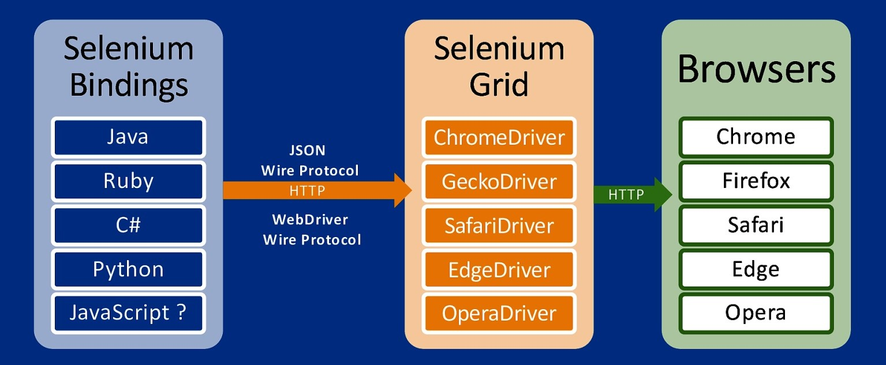

# Java_QA / Level 1. Easy - Основы / 1.1. Selenium WebDriver / Урок 01. Введение

[](1.%20Лекция.md)
[](README.md)
[](3.%20Задание.md)

***

## 1. Настройка окружения

### 1.1. Java

#### Установка JDK (Java Development Kit)

Шаги:

1. Перейти на сайт [Oracle](https://www.oracle.com/java/technologies/javase-downloads.html) и загрузите JDK для вашей платформы.

2. Запустить exe файл.

3. В процессе установки выбрать **Development Tool** и нажать **Next**.

Спустя некоторое время установка завершится.
Итак, Java Development Kit установлен, но это еще не всё. Необходимо настроить его для системы.

#### Настройка переменных сред

Инсталлятор Java выполняет минимальную необходимую настройку окружения, в том числе он добавляет в переменную среды PATH путь к директории, 
которая содержит исполняемые файлы Java (в операционной системе Windows), либо создаёт в стандартной директории для исполняемых файлов символические ссылки 
на установленные исполняемые файлы Java (в других операционных системах).

Но некоторые программы вместо этого используют переменную среды JAVA_HOME, которая должна указывать на директорию, в которую установлена Java. 
Поэтому на всякий случай можно сразу установить эту переменную.

Шаги:

1. Выполнить команду **where java** в консоли.

```bash
where java
```

Эта команда вернёт путь к директории установки Java.

```bash
C:\Program Files\Java\jdk1.8.0_201\bin\java.exe
C:\ProgramData\Oracle\Java\javapath\java.exe
```

2. Скопировать пути к директории установки Java.

3. Открыть **Панель управления -> Система**, выбрать **Дополнительные параметры системы**.


4. В появившемся окне **Свойства системы** нажать кнопку **Переменные среды**.



5. В открывшемся окне **Переменные среды** в блоке **Системные переменные** нужно проверить существует ли переменная **PATH**.


6. Если переменная **PATH** не существует, то ее нужно создать, нажав на кнопку **Создать**.


7. Если переменная **PATH** уже существует, то ее нужно изменить, нажав на кнопку **Изменить**.


8. Для переменной **PATH** нужно установить Значение переменной — скопированный ранее путь к каталогу (**%JAVA_HOME%\bin**), в который была установлена Java (из шага 1).


9. Подобным образом создается/изменяется переменная **JAVA_HOME**.  Значение этой переменной — путь к каталогу, в который была установлена Java (как для PATH), но уже без поддиректории **bin**.


То есть будет примерно так:

* Значение в **PATH**: C:\Program Files\Java\jdk1.7.0_25\bin

* Значение в **JAVA_HOME**: C:\Program Files\Java\jdk1.7.0_25

10. Готово! Установка Java завершена.

#### Проверка правильности установки Java

Шаги: 

1.	Открыть командную строку.

2.	Выполнить команду **javac**, чтобы убедиться, что JRE установлен и настроен.

```bash
javac
```

Если выдаётся список аргументов к команде **javac**, то успешно установлено и настроено все, что необходимо для использования Java!

3. Выполнить команду **where java**, которая должна показать правильный путь до исполняемого файла java.exe.

```bash
where java
```

Эта команда вернёт путь к директории установки Java.

```bash
C:\Program Files\Java\jdk1.8.0_201\bin\java.exe
C:\ProgramData\Oracle\Java\javapath\java.exe
```

4. Выполнить команду **java -version** для проверки того, что это именно та версия, которую устанавливали.

```bash
java -version
```

Эта команда вернет версию Java, которую устанавливали.

```bash
java version "1.8.0_201"
Java(TM) SE Runtime Environment (build 1.8.0_201-b09)
Java HotSpot(TM) 64-Bit Server VM (build 25.201-b09, mixed mode)
```

***

### 1.3. Maven

#### Установка Maven

Шаги:

1. Установить Java.

2. Скачать архив с сайта [Maven](https://maven.apache.org/download.cgi).


3. Распаковать скачанный архив в папку.

4. Установить переменной окружения **M2_HOME** ссылку на местонахождение распакованного архива.

5. Установить еще одну переменную **M2** со значением **%M2_HOME%\bin**.

6. Установить или добавить в переменную **Path** значение **%M2%**, чтобы наша папочка с исполняемым файлом Maven была видна из командной строки.

7. Готово! Установка Maven завершена.

#### Проверка правильности установки Maven

Шаги:

1. Выполнить команду в командной строке **mvn –v**.

```bash
mvn –v
```

2. Если отобразится информация о Maven, то значит, что процесс установки завершен успешно. Все готово к работе.

***

### 1.4. Git

#### Установка Git

Шаги:

1. Скачать последнюю версию программы с сайта [Git](https://git-scm.com/download/win).


2. Запустить программу установки.


3. После успешного запуска программы установки отобразится экран мастера установки Git. 
Для завершения установки следуйте инструкциям, нажимая кнопки Далее и Готово. 
Параметры по умолчанию достаточно хорошо подходят для большинства пользователей.


#### Настройка Git

Настройка системы Git предполагает, в первую очередь, указание имени пользователя и e-mail, 
которые используются для подписи коммитов и отправки изменений в удаленный репозиторий.

Выполнить команду Git

```bash
git config -global
```

#### Проверка правильности установки Git

В командной строке набрать и выполнить команду **git –-version**

```bash
git –-version
```

Если все ок, то в консоли будет выведена версия установленного **Git**

```bash
git version 2.26.2.windows.1
```

***

### 1.5. GitHub

#### Регистрация аккаунта на GitHub

Шаги:

1. Перейти на сайт [GutHub](https://github.com/).


2. Нажать кнопку **Sign up**.

3. На странице регистрации ввести обязательные данные:
   
    * имя пользователя
    * адрес электронной почты
    * пароль


4. На указанную ранее почту придёт письмо с просьбой подтвердить электронный адрес. 
Для завершения регистрации пройдите по полученной ссылке. 

5. Готово! Аккаунт для Гитхаба создан.

#### Создание нового репозитория в GitHub

#### Настройка файла .gitignore

#### Клонирование нового репозитория с GitHub

## 2. Создание нового проекта в папке склонированного репозитория

### 2.1. Создание проекта Maven

### 2.2. Добавление зависимостей в POM

#### 2.1.2. Как подключить JUnit?

В POM.xml добавить следующую зависимость

```xml
<dependency>
    <groupId>org.junit.jupiter</groupId>
    <artifactId>junit-jupiter-engine</artifactId>
    <version>5.1.0</version>
    <scope>test</scope>
</dependency>
```

#### 2.2.2. Как подключить Selenium WebDriver?

В POM.xml добавить следующую зависимость

```xml
<dependency>
    <groupId>org.seleniumhq.selenium</groupId>
    <artifactId>selenium-java</artifactId>
    <version>3.141.59</version>
</dependency>
```

#### 2.3.2. Как подключить WebDriverManager?

В POM.xml добавить следующую зависимость

```xml
<dependency>
    <groupId>io.github.bonigarcia</groupId>
    <artifactId>webdrivermanager</artifactId>
    <version>4.2.0</version>
</dependency>
```

#### 2.4.2. Как подключить Log4J2?

В POM.xml добавить следующую зависимость

```xml
<dependencies>
    <dependency>
        <groupId>org.apache.logging.log4j</groupId>
        <artifactId>log4j-api</artifactId>
        <version>2.14.0</version>
    </dependency>
    <dependency>
        <groupId>org.apache.logging.log4j</groupId>
        <artifactId>log4j-core</artifactId>
        <version>2.14.0</version>
    </dependency>
</dependencies>
```

### 2.3. Подключение и настройка плагина

### 2.4. Настройка логирования

## 3. Написание первого автотеста

## 4. Запуск первого автотеста