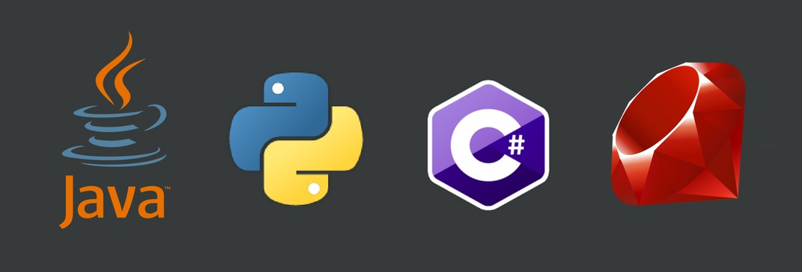
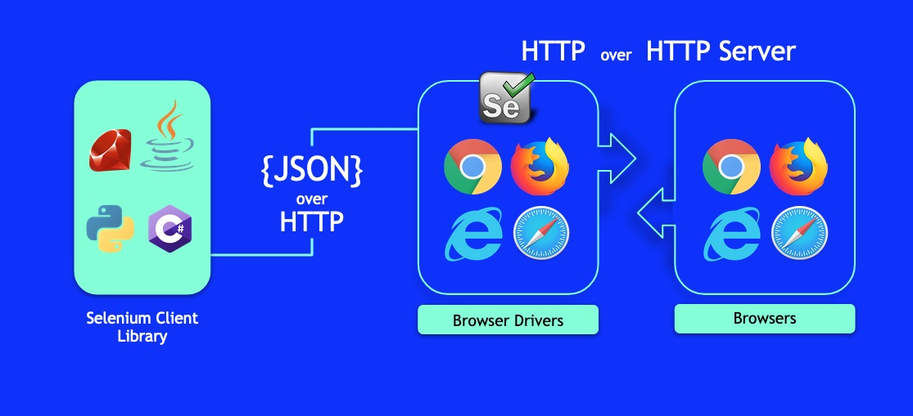

# Java_QA / Level 1. Easy - Основы / 1.1. Selenium WebDriver / Урок 04. Веб драйвер 1. Основы

[](README.md)
[](2.%20Практика.md)

***

## 1. Драйвер браузера

**Selenium WebDriver или просто WebDriver** – программная библиотека для управления браузером.

WebDriver представляет собой:

* **драйверы браузеров** для различных браузеров 

Драйверы реализованы для браузеров Chrome, Edge, InternetExplorer, Firefox, Opera, Safari.
Найти список доступных драйверов и ссылки для скачивания можно на официальном сайте Selenium проекта.


* **клиентские библиотеки** на разных языках программирования, предназначенные для управления этими драйверами

Клиентские библиотеки WebDriver доступны на языках Java, .Net (C#), Python, Ruby, JavaScript.



### 1.1. Вспомогательный исполняемый файл

**Драйвер браузера** - специально написанная программа, которая предоставляет определенный набор команд для управления браузером извне.

Драйвер на самом деле является веб сервером, который запускает браузер и отправляет ему запросы на исполнение определенных действий пользователя, а также закрывает его. 

У каждого браузера свой драйвер, так как у каждого браузера свои отличные команды управления,и реализованы они по-своему. 
Но все драйверы предоставляют единый внешний интерфейс (одинаковый набор команд для управления драйвером) по протоколу, который описан в стандарте W3C.
Каждый драйвер разрабатывает производитель браузера. 



Драйвер браузера поставляется в виде исполняемого файла.

#### Куда положить исполняемый файл?

* в директорию, которая включена в переменную среды **%PATH%**
* в рабочую или текущую директорию (требуется указать путь до файла)
* в любое другое место (требуется указать путь до файла)

> Если же, используется **WebDriverManager**, то делать этого не нужно.

#### Как прописать путь до файла?

Если файл находится не в директории, которая включена в переменную среды **%PATH%**, 
то для того чтобы можно было взаимодействовать с драйвером браузера, необходимо прописать путь до исполняемого файла.

Сделать можно это двумя способами.

* вызвать метод System.setProperty() до вызова конструктора драйвера

```java
System.setProperty("webdriver.ie.driver", "src/test/resources/drivers/IEDriverServer.exe");
```

* использовать класс DriverService и DriverService.Builder, указав в usingDriverExecutable() путь до исполняемого файла

### 1.2. Класс DriverService и DriverService.Builder

**DriverService** - класс для управления исполняемым файлом.

| Тип     | Метод       | Описание                               | 
|---------|-------------|----------------------------------------|
| boolean | isRunning() | проверка запуска сервиса               |
| void    | start()     | запуск сервиса, если он еще не запущен |
| void    | stop()      | остановка сервиса, если он уже запущен |

[DriverService](https://www.selenium.dev/selenium/docs/api/java/org/openqa/selenium/remote/service/DriverService.html)

**DriverService.Builder** - класс для конфигурации нового инстанса DriverService.

| Тип | Метод                            | Описание                                        | 
|-----|----------------------------------|-------------------------------------------------|
| DS  | build()                          | создание нового сервиса для управления сервисом |
| B   | usingAnyFreePort()               | использование любого свободного порта           |
| B   | usingPort​(int port)              | использование конкретного порта                 |
| B   | usingDriverExecutable​(File file) | указание пути до исполняемого файла             |

[DriverService.Builder](https://www.selenium.dev/selenium/docs/api/java/org/openqa/selenium/remote/service/DriverService.Builder.html)

Для исполняемого файла каждого браузера есть свои классы, которые наследуются от **DriverService** и **DriverService.Builder**:

* **Google Chrome**

```java
public class ChromeDriverTest {
    private static ChromeDriverService service;
    public static WebDriver driver;
    
    public static void createAndStartService() throws IOException {
        service = new ChromeDriverService.Builder()
            .usingDriverExecutable(new File(PATH_TO_CHROMEDRIVER_EXE))
            .usingAnyFreePort()
            .build();
        service.start();
    }
}
```

[ChromeDriverService](https://www.selenium.dev/selenium/docs/api/java/org/openqa/selenium/chrome/ChromeDriverService.html)

[ChromeDriverService.Builder](https://www.selenium.dev/selenium/docs/api/java/org/openqa/selenium/chrome/ChromeDriverService.Builder.html)

* **Microsoft Edge**

```java
public class EdgeDriverTest {
    private static EdgeDriverService service;
    public static WebDriver driver;
    
    public static void createAndStartService() throws IOException {
        service = new EdgeDriverService.Builder()
            .usingDriverExecutable(new File(PATH_TO_EDGEDRIVER_EXE))
            .usingAnyFreePort()
            .build();
        service.start();
    }
}
```

[EdgeDriverService](https://www.selenium.dev/selenium/docs/api/java/org/openqa/selenium/edge/EdgeDriverService.html)

[EdgeDriverService.Builder](https://www.selenium.dev/selenium/docs/api/java/org/openqa/selenium/edge/EdgeDriverService.Builder.html)

* **Microsoft Internet Explorer**

```java
public class InternetExplorerDriverTest {
    private static InternetExplorerDriverService service;
    public static WebDriver driver;
    
    public static void createAndStartService() throws IOException {
        service = new InternetExplorerDriverService.Builder()
            .usingDriverExecutable(new File(PATH_TO_IEDRIVER_EXE))
            .usingAnyFreePort()
            .build();
        service.start();
    }
}
```

[InternetExplorerDriverService](https://www.selenium.dev/selenium/docs/api/java/org/openqa/selenium/ie/InternetExplorerDriverService.html)

[InternetExplorerDriverService.Builder](https://www.selenium.dev/selenium/docs/api/java/org/openqa/selenium/ie/InternetExplorerDriverService.Builder.html)

* **Mozilla Firefox**

```java
public class FirefoxDriverTest {
    private static FirefoxDriverService service;
    public static WebDriver driver;
    
    public static void createAndStartService() throws IOException {
        service = new FirefoxDriverService.Builder()
            .usingDriverExecutable(new File(PATH_TO_FIREFOXDRIVER_EXE))
            .usingAnyFreePort()
            .build();
        service.start();
    }
}
```

[FirefoxDriverService](https://www.selenium.dev/selenium/docs/api/java/org/openqa/selenium/firefox/FirefoxDriverService.html)

[FirefoxDriverService.Builder](https://www.selenium.dev/selenium/docs/api/java/org/openqa/selenium/firefox/FirefoxDriverService.Builder.html)

* **Opera**

```java
public class OperaDriverTest {
    private static OperaDriverService service;
    public static WebDriver driver;
    
    public static void createAndStartService() throws IOException {
        service = new OperaDriverService.Builder()
            .usingDriverExecutable(new File(PATH_TO_OPERADRIVER_EXE))
            .usingAnyFreePort()
            .build();
        service.start();
    }
}
```

[OperaDriverService](https://www.selenium.dev/selenium/docs/api/java/org/openqa/selenium/opera/OperaDriverService.html)

[OperaDriverService.Builder](https://www.selenium.dev/selenium/docs/api/java/org/openqa/selenium/opera/OperaDriverService.Builder.html)

### 1.3. WebDriverManager

**WebDriverManager** - программная библиотека решающая проблему с исполняемым файлом посредником и указанием его местоположения.

Все что нужно сделать, это подключить зависимость и прописать одну строчку кода. Никаких исполняемых файлов.

```xml
<dependency>
    <groupId>io.github.bonigarcia</groupId>
    <artifactId>webdrivermanager</artifactId>
    <version>4.3.1</version>
    <scope>test</scope>
</dependency>
```

| Браузер         | Код                                        |
|-----------------|--------------------------------------------|
| Google Chrome   | WebDriverManager.chromedriver().setup();   |
| Google Chromium | WebDriverManager.chromiumdriver().setup(); |
| Microsoft Edge  | WebDriverManager.edgedriver().setup();     |
| Microsoft IE    | WebDriverManager.iedriver().setup();       |
| Mozilla Firefox | WebDriverManager.firefoxdriver().setup();  |
| Opera           | WebDriverManager.operadriver().setup();    |
| PhantomJS       | WebDriverManager.phantomjs().setup();      |

Более подробную информацию по работе с **WebDriverManager** можно узнать в описании репозитория проекта.

[Ссылка на GitHub проекта](https://github.com/bonigarcia/webdrivermanager)

### 1.4. Совместимость драйверов и браузеров

Не все драйверы и браузеры подходят друг другу, даже в рамках одного  браузера (версии могут отличаться)

* **Google Chrome**

| Версия браузера | Версия драйвера     | Производитель драйвера    | 
|-----------------|---------------------|---------------------------|
| последняя       | последняя           | Google - **chromedriver** |
| предыдущие      | поддержка последней | Google - **chromedriver** |

* **Microsoft Edge**

| Версия браузера | Версия драйвера     | Производитель драйвера     | 
|-----------------|---------------------|----------------------------|
| последняя       | последняя           | Microsoft - **edgedriver** |

* **Microsoft Internet Explorer**

| Версия браузера | Версия драйвера     | Производитель драйвера     | 
|-----------------|---------------------|----------------------------|
| 9 - 11          |                     | Selenium                   | 
| <= 8            |                     | драйвер не поддерживается  | 

* **Mozilla Firefox**

| Версия браузера | Версия драйвера     | Производитель драйвера     | 
|-----------------|---------------------|----------------------------|
| >= 49           | последняя           | Mozilla - **geckodriver**  | 
| 48              |                     | драйвер не поддерживается  |  
| 4 - 47          |                     | Selenium                   | 
| <= 3            |                     | драйвер не поддерживается  | 
    
* **Apple Safari**

| Версия браузера | Версия драйвера     | Производитель драйвера     | 
|-----------------|---------------------|----------------------------|
| >= 10           | последняя           | Apple - **safaridriver**   | 
| 6 - 9           |                     | Selenium                   | 
| <= 5            |                     | драйвер не поддерживается  | 

* **Opera**

| Версия браузера | Версия драйвера     | Производитель драйвера         | 
|-----------------|---------------------|--------------------------------|
| >= 15           | последняя           | Opera - **operchromiumdriver** | 
| 11 - 12         |                     | Opera - **operaPrestoDriver**  | 
| <= 10           |                     | драйвер не поддерживается      | 

***

## 2. Интерфейс WebDriver

**WebDriver** - интерфейс для удаленного управления браузером.

### 2.1. Команды веб драйвера

* **Основные**

| Тип  | Метод           | Описание                                                                     | 
|------|-----------------|------------------------------------------------------------------------------|
| void | close()         | закрытие текущего окна, выход из браузера (если было открыто последнее окно) |
| void | get​(String url) | загрузка новой страницы в текущем окне браузера                              |
| void | quit()          | выход из драйвера, закрытие всех окон браузера                               |

* **Поиск веб элементов**

| Тип              | Метод               | Описание                                                     | 
|------------------|---------------------|--------------------------------------------------------------|
| WebElement       | findElement​(By by)  | поиск элемента (возвращает первый найденный элемент)         |
| List<WebElement> | findElements​(By by) | поиск всех элементов (возвращает список найденных элементов) |

* **Свойства текущей страницы**

| Тип    | Метод           | Описание                          | 
|--------|-----------------|-----------------------------------|
| String | getCurrentUrl() | получение строки URL страницы     |
| String | getPageSource() | получение исходного кода страницы |
| String | getTitle()      | получение заголовка страницы      |

* **Навигация**

| Тип                     | Метод              | Описание                              | 
|-------------------------|--------------------|---------------------------------------|
| String                  | getWindowHandle()  | получение окна                        |
| Set<String>             | getWindowHandles() | получение всех окон                   |
| WebDriver.TargetLocator | switchTo()         | управление переключением между окнами |
| WebDriver.Navigation    | navigate()         | управление историей браузера          |

* **Свойства и настройки браузера**

| Тип               | Метод    | Описание                                     | 
|-------------------|----------|----------------------------------------------|
| WebDriver.Options | manage() | управление свойствами и настройками браузера |

[WebDriver](https://www.selenium.dev/selenium/docs/api/java/org/openqa/selenium/WebDriver.html)

### 2.2. Инициализация WebDriver

Чтобы работать с каким то из драйверов нужно в коде инициализировать соответствующий WebDriver.
То есть сконструировать объекта соответствующего класса, который наследует интерфейс WebDriver.
Когда вызывается конструктор, он находит файл посредник.

* **Chromium** 

[ChromiumDriver](https://www.selenium.dev/selenium/docs/api/java/org/openqa/selenium/chromium/ChromiumDriver.html)

* **Google Chrome**

```java
public class ChromeBrowser {
    public WebDriver getDriver() {
        WebDriverManager.chromedriver().setup();
        WebDriver driver = new ChromeDriver();
        return driver;
    }
}
```

[ChromeDriver](https://www.selenium.dev/selenium/docs/api/java/org/openqa/selenium/chrome/ChromeDriver.html)

* **Microsoft Edge**

```java
public class EdgeBrowser {
    public WebDriver getDriver() {
        WebDriverManager.edgedriver().setup();
        WebDriver driver = new EdgeDriver();
        return driver; 
    }
}
```

[EdgeDriver](https://www.selenium.dev/selenium/docs/api/java/org/openqa/selenium/edge/EdgeDriver.html)

* **Microsoft Internet Explorer**

```java
public class ExplorerBrowser {
    public WebDriver getDriver() {
        WebDriverManager.iedriver().setup();
        WebDriver driver = new InternetExplorerDriver();
        return driver; 
    }
}
```

[InternetExplorerDriver](https://www.selenium.dev/selenium/docs/api/java/org/openqa/selenium/ie/InternetExplorerDriver.html)

* **Mozilla Firefox**

```java
public class FirefoxBrowser {
    public WebDriver getDriver() {
        WebDriverManager.firefoxdriver().setup();
        WebDriver driver = new FirefoxDriver(options);
        return driver;
    }
}
```

[FirefoxDriver](https://www.selenium.dev/selenium/docs/api/java/org/openqa/selenium/firefox/FirefoxDriver.html)

* **Opera**

```java
public class FirefoxBrowser {
    public WebDriver getDriver() {
        WebDriverManager.operadriver().setup();
        WebDriver driver = new OperaDriver();
        return driver; 
    }
}
```

[OperaDriver](https://www.selenium.dev/selenium/docs/api/java/org/openqa/selenium/opera/OperaDriver.html)

***

## 3. WebDriverFactory

В объектно-ориентированном программировании (ООП), **Factory (фабрика)** — это объект для создания других объектов. 
Формально **Factory** — это функция или метод возвращающая объекты изменяющегося прототипа или класса из некоторого вызова метода, который считается «новым».
Или, простыми словами, **Factory** создает экземпляр класса без раскрытия логики его создания.

**WebDriverFactory** - *фабрика* для создания объектов WebDriver для разных браузеров.

Для понимания того, зачем нужно его использовать, следует сначала понять проблему, который решает этот паттерн.

Для примера рассмотрим следующий код:

```java
@Test
void test(){
    ChromeDriver driver = new ChromeDriver();
    driver.get("https://otus.ru");
    Assert.assertEquals(driver.getTitle(),"Otus - онлайн образование");
}
```

Данный тест  запускает Chrome, проверяет, что title страницы совпадает с ожидаемым. 
Далее создаются еще несколько таких тестов, добавляются их в скоуп тестирования для параллельного тестирования. 
И вроде, все хорошо ровно (за исключением нарушений принципов DRY и SOLID) до момента, 
когда встает вопрос о том, чтобы запускать тесты в другом браузере, запускать браузер с какими-то параметрами или с определенными расширениями.
В решении данной проблемы может помочь паттерн **Factory**.

Рассмотрим простейшую фабрику. 
Для этого нужно создать метод, который принимает на вход название браузера и возвращает соответствующий браузер 
(если браузер был указан некорректно – выбросит ошибку с соответствующим сообщением).

```java
WebDriver getWebDriver(String browserName){
    switch (browserName){
        case "chrome":
            return new ChromeDriver();
        case "firefox":
            return new FirefoxDriver();
        default:
            throw new RuntimeException("Incorrect BrowserName");
    }
}
```

Теперь в тесте будет достаточно вызвать соответствующий метод для получения Webdriver'a:

```java
@Test
void test(){
    WebDriver driver = getWebDriver("chrome");
    driver.get("https://otus.ru");
    Assert.assertEquals(driver.getTitle(),"Otus - онлайн образование");
}
```

Готово! Теперь при изменении параметров запуска браузера (к примеру, требуется добавить Cookie), это можно будет сделать из одного места.

***

Практика [](2.%20Практика.md)