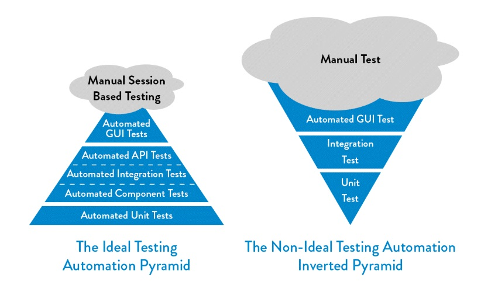

# Java_QA / Level 0. Zero - Подготовка / 0.1. Git / Урок 01. Введение

***

## 1. Что такое автоматизация тестирования?

***Автоматизированное тестирование ПО*** — процесс тестирования программного обеспечения, при котором основные функции и шаги теста, такие как запуск, инициализация, выполнение, анализ и выдача результата, производятся автоматически с помощью инструментов для автоматизированного тестирования.

В свою очередь, инструмент для автоматизированного тестирования — это программное обеспечение, посредством которого осуществляется создание, отладка, выполнение и анализ результатов прогона тест-скриптов (Test Scripts — это наборы инструкций для автоматической проверки определенной части программного обеспечения).

Существует два основных подхода к автоматизации тестирования: 

* тестирование на уровне кода 

К первому типу относится, в частности, модульное тестирование.

* тестирование пользовательского интерфейса (в частности, GUI-тестирование). 

Ко второму — имитация действий пользователя - функциональное тестирование (с помощью специальных тестовых фреймворков.)

***Автоматизатор*** – специалист занимающийся написанием автоматизированных тестов.

Автоматизатор, который миновал стадию ручного тестирования, зачастую умеет просто писать код. Но этого мало. 
И в двух словах всю недостающую базу не объяснишь. Чтобы ее получить, нужно обратиться в сторону функционального тестирования, 
как бы странно это ни звучало. Мы же в первую очередь тестировщики, а уже потом автоматизаторы.

***Автотест (автоматизированный тест)*** – скрипт, имитирующий взаимодействия пользователя с приложением, цель которого – локализация ошибок в работе программного обеспечения.

***

## 2. Какие есть преимущества и недостатки у автоматизации тестирования?

### Преимущества

* *Оперативность* – автоматизированный скрипт не сверяется с инструкциями и документацией.

* *Экономия времени* – автоматизация не требует вмешательства тестировщика, в это время он может переключиться на другие задачи.

* *Повторное использование* – сценарий тестирования может использоваться неоднократно.

* *Отсутствие «человеческого фактора»* – тестовый сценарий не допустит оплошностей в результатах и не пропустит времени тестирования.

* *Автоматическая отчетность* – результаты тестирования автоматически сохраняются и рассылаются причастным специалистам.

### Недостатки

* *Затраты* – хорошие инструменты автоматизированного тестирования, как и обучение автоматизированному тестированию ПО требует вложений.

* *Однообразие* – написанные тесты работают всегда одинаково, что не всегда плохо, но иногда позволяет пропустить дефект, который заметил бы живой человек.

* *Затраты на поддержку и разработку* – чем сложнее приложение и чем чаще оно обновляется, тем более затратная разработка и модификация автоматизированных тестов.

* *Пропуск мелких недочетов* – тесты пропускают небольшие ошибки, на проверку которых не запрограммированы. 

* *Стоимость инструмента для автоматизации* – в случае, если используется лицензионное ПО, его стоимость может быть достаточно высока. 
Свободно распространяемые инструменты, как правило, отличаются более скромным функционалом и меньшим удобством работы.

***

## 3. В каких случаях полезна автоматизация тестирования?

### Автоматизация будет полезной, если

* Ваша первоочередная задача – сэкономить время проектной команды.
* Тесты должны выполняться для каждой сборки приложения.
* Ваш проект длительный или комплексный (состоит из различных итераций).
* На выполнение тест-кейсов тратится много времени и ресурсов.	
* Проводится нагрузочное или стресс-тестирование.	
* Нужно сократить текущий объем тестирования с целью успеть к определенным срокам.

### Автоматизация не будет полезной, если

* Для выполнения тестирования нужен человеческий интеллект и интуиция.
* Процесс тестирования ограничен интуитивными или исследовательским проверками.
* Требования, относящиеся к существующей функциональности, часто изменяются.
* Нужно провести тестирование только единожды.

### Автоматизация применяться не может, если

* Необходимо тестирование пользовательского интерфейса 

Ручное тестирование проверит общий вид приложения (четкость изображений, расположение и отображение элементов графического интерфейса при разных разрешениях экрана и др.), а также отдельно взятые компоненты (например, цвет шрифта – сможет ли конечный пользователь его легко воспринимать). Ручные проверки покажут, соответствует ли графический интерфейс предпочтениям потребителей.

* Необходимо тестирование удобства использования. 

Оно ответит с точки зрения пользователя на вопрос, является приложение простым в использовании или нет.

* Необходимо интуитивное тестирование. 

Это тип проверок, при котором тест-кейсы не создаются заранее, а QA-инженеры тестируют приложение и исследуют его «на ходу».

***

## 4. Какие существуют направления автоматизации тестирования?

**GUI - тестирование** — оценка функционирования графического интерфейса приложения.

**API - тестирование (Тестирование веб-сервисов)** — тестирование функционала web-сервисов, реализованное автоматизированными средствами.

**Тестирование мобильных приложений** — проверка работоспособности функционала мобильного приложения на различных мобильных устройствах и операционных системах.

**Тестирование баз данных** — оценка соответствия БД функциональным и нефункциональным требованиям.

**Тестирование веб-приложений** — проверка работоспособности модулей веб-приложений

***

## 5. Из каких этапов состоит автоматизация тестирования?
    
1). Начальный этап:
* Анализ
* Описание тестов
* Разработка общих функций
2). Активный этап:
* Разработка
* Поддержка

Схема этапов

### Начальный этап

**Стадия анализа**

На данном этапе происходит принятие решения о необходимости автоматизированного тестирования, оцениваются потенциальные возможности и экономический эффект, определяются цели и стратегии автоматизации, выделяются виды тестов, пригодные для автоматизации. 
На этом же этапе после тщательного изучения свойств, оценки степени соответствия конкретной задаче, а также оценки ресурсов, необходимых для поддержания нормального функционирования, осуществляется выбор средства автоматизации. 

**Стадия описания**

В результате начальных разработок уточняются требования к описанию тестов, проверяется совместимость средств автоматизации и тестируемого программного средства, а также тестового окружения, вырабатываются точные методы оценки затрат на реализацию. Определяются стандарты разработки тестовых скриптов, руководств, требования к аппаратному и программному обеспечению, сетевому окружению, наборам тестовых данных. 
На данном этапе важно определить методы контроля тестового окружения и систему мониторинга дефектов системы. 

**Стадия разработки общих функций**

Анализируются и разрабатываются общие функции.
Результатом первого этапа процесса автоматизации является составление предварительного графика тестирования.

### Активный этап

**Стадия разработки**

Подавляющая часть времени на этом этапе направлена на описание, разработку, тестирование и запуск автоматических тестов. Уменьшается объём ресурсов, требуемых для разработки общих функций. В случае больших проектов команда разработчиков тестов может быть значительно увеличена, при этом успешно завершённый этап подготовки и планирования гарантирует минимальность рисков. 
При разработке тестов важно предусмотреть возможность автоматического документирования найденных дефектов и составления общего отчета о результатах выполнения автоматических тестов. 
После успешного запуска автоматических тестов производится анализ полученных результатов и при необходимости их доработка. 
Этап активной разработки может быть довольно продолжительным в зависимости от объёмов проекта. 

**Стадия поддержки**

Для автоматизации тестирования выбираются только те тесты, которые проверяют неизменяющуюся часть программы. Однако, изменение требований к входным данным, обновление настроек или структуры тестового окружения могут привести к тому, что автоматические тесты будут выдавать ошибочные результаты. Поэтому всегда необходимо следить за изменениями в системе и при необходимости корректировать или дорабатывать автоматические тесты для поддержания их в актуальном состоянии.

***

## 6. Из каких процессов состоит автоматизированное тестирование?

**Подготовка тестового окружения**

Перед началом запуска прогона тестов производится настройка тестового окружения – проверяются подключения, настройки и т д. 

**Генерация тестовых данных**

Наиболее ресурсоёмкая часть тестирования – это подготовка тестовых данных. Они зависят от типа и цели тестирования, стадии разработки проекта и много от чего ещё.

**Запуск тестов**

Производится запуск автоматизированных тестов и проведение регрессионного автоматизированного тестирования, если необходимо.

**Формирование отчета**

Составляется итоговый документ с результатами тестирования, который содержит обнаруженные дефекты, отклонения от нормативов и предложения по улучшению системы. 
Создаются руководство пользователя и инструкции по настройке и сопровождению системы автоматизированного функционального тестирования.

**Очистка окружения после тестирования**

Производится восстановление состояния тестового окружения к изначальному.

**Анализ результатов**

Проводится анализ результатов тестирования. Делаются выводы об успешности проведенного тестирования.

***

## 7. В каком объеме тестировать автотестами?

### Принцип пирамиды

Автоматизация процессов тестирования тесно связана с именем Майка Кона, автора книги «Scrum. Гибкая разработка ПО». 
Он представил систему автоматизации тестирования в виде пирамиды.

Основание пирамиды составляет **модульное тестирование (Unit tests)** – процесс проверки отдельных модулей исходного кода. 

За ним следует **компонентноеинтеграционное//API тестирование (Component/Integration/API tests)** – на этом этапе отдельные программные модули тестируются в группах.
 
Далее может следовать **приемочное тестирование (Acceptance tests)**, определяющее пригодность продукта к предстоящей эксплуатации. 

На вершине пирамиды обосновалось **тестирование пользовательского интерфейса (UI tests)**, которое может проводиться как автоматизировано, так и вручную. 

Таким образом, автоматизированное тестирование находится на стыке тестирования и программирования.

Над вершиной часто располагают **ручное тестирование** в форме облака, поскольку оно не считается неотъемлемой частью пирамиды, хоть и взаимосвязано с ней. 

Данная пирамида считается типичной для автоматизации тестирования, хотя может быть перевернута и модифицирована в зависимости от специфики работ.

И чем ближе к вершине пирамиды, тем меньше должно быть тестов.

***

## 8. Как оценить результат выполнения автоматизированных тестов?

### Отчеты 

После выполнения автоматизированных тестов составляются отчеты в виде таблиц, графиков, диаграмм. 
Для этого применяются различные инструменты, плагины и библиотеки. Например Allure или Report Portal.

### Статистика

В отчетах ведется автоматический подсчет количества успешно отработанных сценариев, упавших тестов, найденных багов. 

### Метрики

Далее на основе полученных данных по специальным методикам составляются метрики, позволяющие сделать выводы о результатах тестирования

***

## 9. Какие существуют инструменты автоматизации тестирования?

К инструментам автоматизации тестирования относят программное обеспечение, используемое для создания, наладки, выполнения и анализа результатов работы автоматизированных тестов.

Выбор инструмента зависит от объектов тестирования и требований к сценариям тестов. 
Естественно, что один инструмент не в состоянии поддерживать весь спектр технологий, потому остается только пробовать и искать наиболее подходящий. 
Достаточно часто QA-инженеры останавливают свой выбор на нескольких инструментах.

Инструменты делятся на основные и вспомогательные:

1. Основные

* Язык программирования – Java, Ruby, Python, C#, JS 
* Сборщик проектов – Maven, Gradle, Nuget
* Фреймворк тестирования – JUnit, TestNG, PyTest, NUnit 
* BDD фреймворк – Cucumber
* Драйвер – Selenium WebDriver

2. Вспомогательные

* Среда разработки – Jetbrains IntelliJ IDEA, MS Visual Studio
* Система контроля версий – Git, SVN
* Сервис хранения проектов - Github, Bitbucket
* Сервер непрерывной интеграции – Jenkins, Gitlab CI, TeamCity, Bamboo
* Инструменты хранения и анализа отчетов – Allure, Report Portal
* Система управления тестами – Zephyr, HP ALM, Test IT